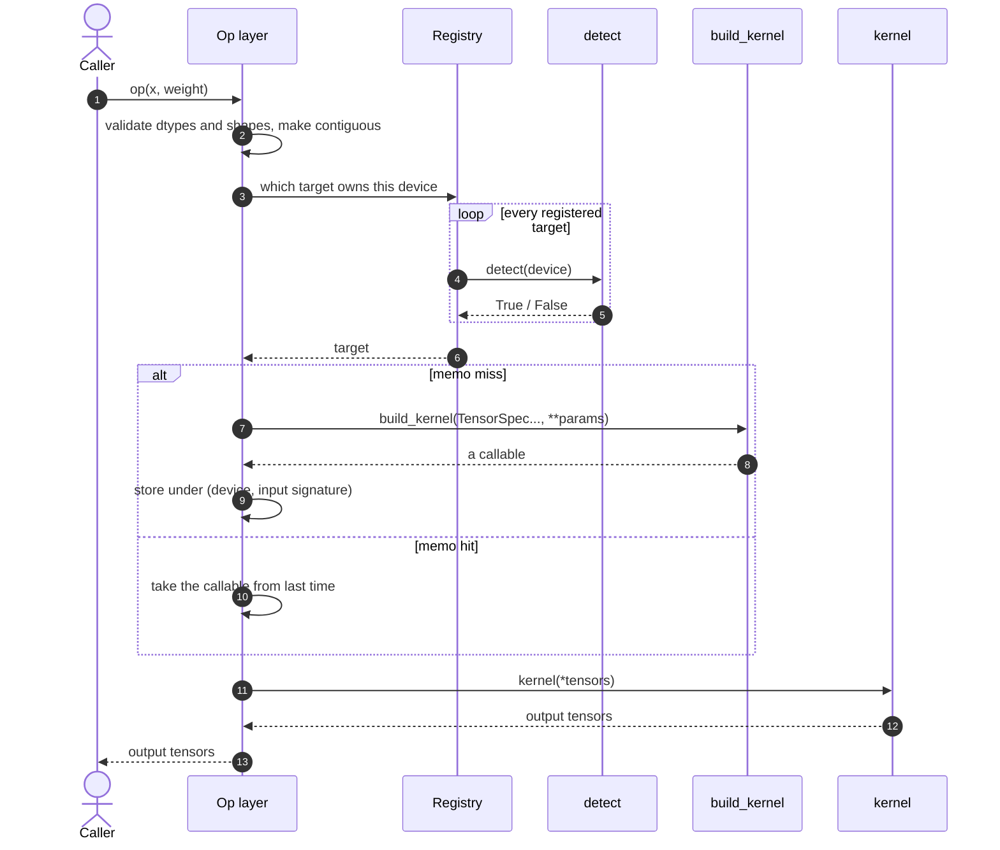

# Adding a hardware backend

TileLang is a multi-backend DSL: each kind of hardware has its own set of kernels,
shipped as its own Python package. TileOPs therefore defines a protocol under
which a package outside the repository takes over an op's kernel, replacing the
implementation TileOPs ships — and adding one requires no change to TileOPs itself.

This page is about bringing a new class of hardware into TileOPs, so that the ops
on those devices run your own kernels.

**A backend supplies one thing: something callable that computes this call.**
Everything else is the op layer's.

This page has two halves. The first is what a backend author does, in the order they do
it: the four things to write, the protocol's four functions, a backend that installs and
runs as it stands, how a builder's signature is fixed, the phase limits a kernel has to
respect, how to turn the template into a backend for real hardware, and what each error
after install means.

The second half is why the protocol looks like this: the two layers of selection, the op
layer's contract, when a kernel is rebuilt, the three states the migration leaves an op
in, what a caller can reach for, and what the protocol deliberately leaves out.

## Four things to write

| # | What to do |
| --- | --- |
| 1 | An entry point in `pyproject.toml` pointing at the backend module |
| 2 | A target name and a `detect`, declaring which class of devices these kernels are for |
| 3 | A `build_kernel` for the first op you take over, written to its manifest signature |
| 4 | The `register_detector` and `register_kernel_builder` calls, at module top level |

With those four written, `pip install` is all it takes for the backend to take effect;
the next section is an example that installs and runs as it stands.

Then add a `build_kernel` per op. **Every op the target model uses has to be
covered** — a missing one is an error, with no fall back to the implementation
TileOPs ships, because those kernels cannot launch on this target's devices.

## The protocol: four functions

`tileops.backend` defines the outward-facing interface and contains no
implementation. The interface is expressed with Python structural typing
(`typing.Protocol`): a backend subclasses nothing and implements no abstract method, it
writes plain functions with matching signatures and registers them. The op layer checks a
backend's return value structurally too: `callable()`.

A backend writes two functions (`detect`, `build_kernel`) and calls two to register
them (`register_detector`, `register_kernel_builder`), alongside the protocol's
`TensorSpec` and one entry point in `pyproject.toml`:

| Name | Written by | Called by, and when |
| --- | --- | --- |
| `detect` | implemented by the backend | asked of every target while the op layer picks one for a call |
| `register_detector` | the backend calls it | once, when the backend module is imported |
| `register_kernel_builder` | the backend calls it | likewise, once per op it takes over |
| `TensorSpec` | defined by the protocol | built by the op layer and passed into `build_kernel` |
| `build_kernel` | implemented by the backend | called by the op layer on a memo miss |
| the entry point | declared by the backend in `pyproject.toml` | enumerated by TileOPs when the first op is constructed |

The five signatures, and what each is for.

### `detect`

```python
def detect(device: torch.device) -> bool: ...
```

Implemented by the backend. Answers whether such a device is served by this set of
kernels: devices only, not dtypes or shapes; return `False` for someone else's device, and
do not raise.

### `build_kernel`

```python
def build_kernel(*inputs: "TensorSpec | None", **params) -> Callable[..., KernelResult]: ...
```

Implemented by the backend, one per `(op, target)`. Its signature is the op's manifest
signature: `inputs` correspond one-to-one to `signature.inputs` in declaration order, and
`params` are named after `signature.params`. An input declared optional that was not
passed on this call arrives as `None`.

### `register_detector`

```python
def register_detector(target: str, detect: Callable[[torch.device], bool]) -> None: ...
```

Called by the backend, once per target, at module import time. Registers that target's
device detection.

### `register_kernel_builder`

```python
def register_kernel_builder(op: str, target: str, build_kernel: BuildKernel) -> None: ...
```

Called by the backend, once per op it takes over. Registers the kernel builder for
`(op, target)`; registering the same pair twice is an error.

### `TensorSpec`

```python
class TensorSpec(NamedTuple):
    device: torch.device
    dtype: torch.dtype
    shape: tuple[int, ...]
```

Defined by the protocol, built by the op layer and passed into `build_kernel`. What a
tensor is, without the tensor.

The return value has one structural requirement: **it must be callable**, invocable
as `(*tensors)`, returning a tensor, a tuple of tensors, or `None` for a pure
in-place write. What the op layer checks is `callable()`.

**The protocol passes descriptions, not tensors.** That removes the need for a rule
the op layer could not enforce — "a builder must not read tensor contents or keep a
reference to a tensor". Two things are what such a rule would guard against:

- **Reading data** would make the built kernel depend on data, while the memo table
  keys only on device and shape.
- **Keeping a reference** would have a tensor live as long as the cached kernel does.

A `TensorSpec` carries neither data nor tensor, so neither is expressible.

## One call, in sequence

The path one call takes. `detect`, `build_kernel` and `kernel` are the backend's;
everything else is the op layer, and `kernel` is the callable `build_kernel` returned:



Step 7 happens only on a memo miss, which is why `build_kernel` may compile; step 12
happens on every call, which is why it may not compile or initialise lazily — see [phase
limits](#phase-limits).

## Writing a backend that runs

[`tileops-backend-example`](https://github.com/lcy-seso/tileops-backend-example) is
a complete backend written to those four steps. It implements its kernels in pure
PyTorch and claims CPU, so it installs, runs and tests anywhere; apart from the
kernels touching no dedicated hardware, every other part — entry point,
registration, the `build_kernel` signature, the memoisation rule, the error
messages — is what a backend for dedicated hardware writes.

What installing it changes:

```console
$ python -c "import torch; from tileops.ops.norm.rms_norm import RMSNormFwdOp; \
             RMSNormFwdOp(normalized_shape=(64,))(torch.randn(4,64,dtype=torch.float16), \
                                                  torch.randn(64,dtype=torch.float16))"
ValueError: RMSNormKernel is a CUDA kernel; got x on cpu and weight on cpu.

$ pip install -e .

$ python -c "...the same code..."
# returns normally, bit-identical to torch.nn.functional.rms_norm
```

Here is what it writes, step by step.

**Step 1, three lines of `pyproject.toml`.** The entry-point group is always
`tileops.backends`, and the value is the backend's module:

```toml
[project.entry-points."tileops.backends"]
torch_cpu = "tileops_cpu"
```

After `pip install` nothing initialises anything: TileOPs enumerates this group while
constructing its first op, imports the module named there, and the registration calls at
module top level fill the registry. There is no base class to inherit and no interface to
implement.

**Step 2, a target name and a `detect`.** This `detect` is a single line — it claims every
CPU device:

```python
from tileops.backend import TensorSpec, register_detector, register_kernel_builder

register_detector(
    target="torch_cpu",
    detect=lambda device: device.type == "cpu",
)
```

The two names mean different things: `target="torch_cpu"` names this set of kernels and is
the backend author's to choose, while `device.type == "cpu"` is the device type it claims,
defined by torch.

**Step 3, a `build_kernel` written to the manifest signature.** `RMSNormFwdOp`'s spec
declares two inputs, `x` and `weight`, and two params, `normalized_shape` and `eps`; the
function's parameters follow that declaration:

```python
from .kernels import CpuRMSNorm


def build_rms_norm(
    x: TensorSpec,
    weight: TensorSpec,
    *,
    normalized_shape,
    eps,
):
    return CpuRMSNorm(normalized_shape, eps, x.dtype)
```

**Step 4, the registrations at module top level.** One per op taken over:

```python
register_kernel_builder(
    op="RMSNormFwdOp",
    target="torch_cpu",
    build_kernel=build_rms_norm,
)
```

## Writing a kernel

### The signature comes from the manifest

**Writing a kernel needs the manifest, not the TileOPs source.** A builder's signature is
the op's manifest signature. `RMSNormFwdOp` in
[`src/tileops/manifest/normalization.yaml`](https://github.com/tile-ai/TileOPs/blob/main/src/tileops/manifest/normalization.yaml):

```yaml
signature:
  inputs:                       # declaration order is call order
    x: {dtype: "float16 | bfloat16"}
    weight: {dtype: "same_as(x)"}
  params:                       # passed as keyword arguments under these names
    normalized_shape: {type: "list[int] | tuple[int, ...]"}
    eps: {type: "float | None", default: null}
```

The corresponding builder signature:

```python
def build_rms_norm(x: TensorSpec, weight: TensorSpec, *, normalized_shape, eps):
```

Two things to note about it.

- **`eps` arrives as `1e-6`, not `None`.** The manifest default is null, but the op
  layer has already normalised it to a definite value. Every optional parameter behaves
  this way.
- **The return value follows `signature.outputs`** — a tensor for a single output,
  a tuple in declaration order for several, `None` for a pure in-place write.

### The constructor takes compile-time parameters only

Values compiled into generated code — tile sizes, dimensions treated as constants,
dtypes — belong in the constructor; the rest belongs to `__call__`.

Decode makes this a hard requirement: `seq_len` grows step by step and batch changes with
the running set, so putting them in the constructor means recompiling every step.

### Shapes are the manifest's

The op layer does not change shapes before handing tensors over: a kernel receives the
shapes the manifest declares, and whatever layout it needs it arranges itself, inside its
own call wrapper.

Where the code and the manifest both describe something, the manifest governs. Output
dtype, shape rules and parameter types are the manifest's, and a kernel does not rewrite
them.

### What a kernel's error has to say

A kernel that cannot serve a call raises rather than degrading, and the error has to say
two things:

- **Which item is unmet** — dtype, shape, arch, no implementation available,
  compilation failed.
- **The value it actually received.**

"Unsupported" on its own is not a diagnosis.

## What each phase may do {#phase-limits}

The decode path is captured by a CUDA graph, so each phase is bounded separately:

| Phase | May | May not |
| --- | --- | --- |
| Memo lookup (its key and rebuild rules are [below](#memo)) | one dict lookup | anything else |
| `detect` | one predicate | any import, any lock |
| Building a kernel | select an implementation, compile, allocate, re-import, build handles | tuning that depends on real tensors |
| Calling a kernel | launch a compiled kernel, allocate outputs through the torch allocator | compile, lazy init, build handles, host-side synchronisation |

**A module-level import must not trigger compilation.** TileOPs imports the backend
module while constructing the first op; compilation belongs in `build_kernel`.

A kernel call has two further stream rules:

- **Launch on the current stream**, under CUDA `torch.cuda.current_stream(device)`;
  never fall through to the default stream. Backends with their own launcher break
  this most easily.
- **Internal allocations must outlive asynchronous execution.** Where only a raw
  pointer is passed to a launch, the object has to stay alive until that stream has
  finished. The protocol provides no workspace; this safety is the backend's.

The caller warms up before capture — at least one non-captured call at the same
shape — because building a kernel may compile. During capture only one path is
allowed: memo hit, then call.

## The template project: layout, tests, adapting it

### Repository layout

Each file in the example covers one part of the work:

| File | Contents |
| --- | --- |
| `pyproject.toml` | the entry point declaration, which is the whole install mechanism |
| `src/tileops_cpu/__init__.py` | all registration code |
| `src/tileops_cpu/kernels.py` | the kernel implementation; a real backend compiles here |
| `src/tileops_cpu/pending.py` | a registered builder that cannot be called yet — see [below](#three-states-after-install) |
| `tests/test_takeover.py` | numerics, validation, normalisation, outputs |
| `tests/test_discovery.py` | entry point and registration |
| `tests/test_errors.py` | the four error paths |
| `tests/test_memoization.py` | when `build_kernel` is called again |

`CpuRMSNorm` does not receive the row count when it is constructed, which is
"compile-time parameters only" in practice.

### Running the tests

The tests need an environment with `tileops` installed:

```bash
pip install -e .          # add --no-deps when tileops is already installed
python -m pytest -q       # with a GPU: 22 passed; without: 20 passed, 2 skipped
```

The same holds inside the TileOPs dev image, again without modifying TileOPs:

```bash
docker run --rm --gpus all -v "$PWD/..":/work -w /work \
  ghcr.io/tile-ai/tileops-runner:cu132-torch2.13-tl-afcebed1-dev \
  bash -lc 'pip install -e /work/TileOPs --no-deps -q &&
            pip install -e /work/tileops-backend-example --no-deps -q &&
            cd /work/tileops-backend-example && python -m pytest -q'
```

`tileops` is deliberately absent from the example's dependencies. The package
extends an installation that already exists, and a version floor here would resolve
a release predating `tileops.backend`; the resulting `ImportError` is collected into
`load_failures()` and presents as "this backend is unusable" when the real cause is
that TileOPs is too old.

### Turning it into a backend for real hardware

1. Copy the repository, rename `tileops_cpu` to `tileops_<hardware>`, and the target name with it.
2. Change `_detect` to claim the corresponding device type.
3. Replace `kernels.py` with real kernels — compile on construction, launch on `__call__`.
4. Pick the first op to take over and write its `build_kernel` against the op's manifest signature.
5. The four files under [`tests/`](https://github.com/lcy-seso/tileops-backend-example/tree/main/tests) carry over largely as they are; substitute the op and target names.
6. Add a `build_kernel` per op from there, until every op the target model uses is covered.

## Error messages and what to do

All four are measured output, each with one cause and one way to handle it.

**A builder is registered, but the op does not pass its tensors yet:**

```
OpNotAvailableError: target 'torch_cpu' serves GemmOp, but its 'gemm_kernel' call site
does not hand over the tensors a builder is described with; that op is not wired to
external targets yet
```

A gap on the TileOPs side, not a backend problem. Wait for `inputs=` to be added,
or file an issue asking for that op to be prioritised.

**No builder registered for the op:**

```
OpNotAvailableError: target 'torch_cpu' registers no kernel builder for SoftmaxFwdOp;
targets that do: []. There is no fall back to the in-tree implementation: those kernels
do not run on this target's devices.
```

Write and register a builder for that op.

**An unregistered target was named:**

```
UnknownTargetError: no backend registered target 'nope'; known targets: ['torch_cpu']
```

The package did not install, or the target name is misspelled. Use
`tileops.backend.registered_targets()` to see what actually registered.

**`target=BUILTIN` forces the implementation TileOPs ships:**

```
ValueError: RMSNormKernel is a CUDA kernel; got x on cpu and weight on cpu.
Another target's backend serves other devices.
```

`BUILTIN` bypasses backends explicitly. The shipped implementation cannot run on
CPU tensors, which is precisely the outcome the no-fall-back rule avoids.

**When a backend package fails to import**, TileOPs skips it, warns, and collects
the reason into `load_failures()`. One broken plugin does not make TileOPs
unimportable. If registration raises part way through, everything that backend
registered in that pass is **rolled back** — no half-implemented target is left in
the registry.

```python
from tileops.backend import load_failures
print(load_failures())
```

## Why selection has two layers

| Name | Definition | Where it sits in dispatch |
| --- | --- | --- |
| **target** | The name of one set of kernels. A backend release brings a set of kernels and gives it a name, e.g. `"acme"` | The first layer: pick a target, and this call's kernel comes from its set |
| **`detect`** | A function a backend writes, one per target | How the first layer picks: it receives a `torch.device` and answers whether such a device is what its kernels are for; `False` if not |
| **`build_kernel`** | A function a backend writes per op, one per `(op, target)` | The second layer: it receives a description of this call — each input's device, dtype and shape, plus the op's parameters — and picks, builds and returns a kernel from its own set |

**Selection has two layers: TileOPs picks the target, the target picks the
kernel.** The second happens inside `build_kernel`, with no protocol involvement;
there is no kernel-level concept, no capability negotiation and no candidate
filtering.

`detect` answers only which devices belong to the backend, and that is as fine as
it gets. **Whether this call is supported — dtype, shape, parameter combination —
is answered by `build_kernel`**, the only place that sees the full input
description and the parameters; it raises there when it cannot serve the call.
Leaving those judgements to `detect` is not possible: all it receives is a
`torch.device`.

TileOPs does not parse `torch.device` — it passes it through to `detect`. Device
types and targets are not in one-to-one correspondence: one device type can carry
several sets of kernels from different vendors; some hardware arrives through
`privateuseone`, whose string carries no vendor information at all; and some
backends have to read an environment variable or call a vendor runtime to decide.

## The op layer's contract

The seven below are the op layer's contract to every target: it implements them and a
backend reuses them rather than writing its own. They are listed in the order a backend
author meets them:

| # | The op layer supplies | What it means for a backend |
| --- | --- | --- |
| 1 | The public torch-side API and the meaning of each parameter | How the op is called, the parameter names and their semantics are settled; a backend neither defines nor changes them |
| 2 | Manifest validation | A call whose dtype or shape does not conform is rejected at the op layer and never reaches the backend |
| 3 | Parameter normalisation | Parameters arrive as definite values. Where the manifest declares `eps` as float or None, what arrives is the number the op layer computed, not `None` |
| 4 | Input contiguity | A backend only ever receives contiguous tensors |
| 5 | Memoisation and reuse of kernels | The builder is called once per specialization: a later call with the same device and input signature reuses the previous return value. A builder may therefore compile, and the op layer guarantees it is not called again |
| 6 | The `torch.compile` and CUDA-graph boundary | The op layer wraps a call as an opaque operator and registers a fake alongside, so the compiler can infer the output's shape and dtype without executing. **A backend's kernels do nothing for compilation**; see [Bringing an op into torch.compile](torch-compile.md) |
| 7 | Roofline, profiling and numerical tests | The op layer's existing tests run once with the backend's kernel and compare against the manifest's `ref_api`; performance reports are produced as usual |

None of the seven depends on hardware and every target gets them identically; a
third-party backend neither bypasses one nor substitutes its own.

The kernels TileOPs ships ([`src/tileops/kernels/`](https://github.com/tile-ai/TileOPs/tree/main/src/tileops/kernels)) are the **default
implementation**: they have no target name and are not in the registry.

**The default state is no substitution.** With no backend claiming a device, calls on
it run the shipped implementation; only once a backend is installed and has claimed
that device does the op's kernel become the backend's. The protocol has no notion of a
"default target".

## When a kernel is rebuilt {#memo}

TileOPs remembers a builder's return value by **device plus input signature**:

> the device this call's tensors are on, plus `(dtype, shape)` taken per input in
> `signature.inputs` order; an optional input not passed on this call is recorded
> as `None`.

That is: **two calls agreeing on device and input signature get the same kernel
back**, with no further call to `build_kernel`; a second card under the same target
builds again, because an artefact compiled for one device need not launch on
another. Params are not part of the key — they are fixed for an op instance.

Two consequences:

- **The memo table is bounded and an entry can be evicted at any time.** A backend
  must not assume the callable it returned stays alive; whatever resources it
  depends on, it holds references to itself.
- **A finer or a coarser grain is resolved on the backend side.** Finer
  distinctions happen inside the backend; to rebuild less often, add a cache inside
  `build_kernel`.

## Three states after install

Once `detect` claims a class of devices, **every** op on those devices is served by
that target, a missing one is an error, and there is no fall back to the
implementation TileOPs ships.

The reason for not falling back: selecting a target means this device belongs to other
hardware, where the shipped kernels cannot launch at all. Falling back would trade a
clear "this target does not implement this op" for an incomprehensible launch
failure.

So after install, each op is in one of three states:

| State | Example | Result |
| --- | --- | --- |
| A builder is registered, and the op passes its tensors at the kernel-fetch site | `RMSNormFwdOp` | runs |
| A builder is registered, but the op does not pass its tensors yet | `GemmOp` | error — **TileOPs is what needs changing** |
| No builder registered | every other op | error |

The second state follows from where TileOPs is in its migration: the site where an
op fetches its kernel has to pass the tensors that kernel will be called with, or
TileOPs cannot compute the memo key for the external path.

```python
# inside TileOPs, in the op's own forward
self.get_or_build_kernel("gemm_kernel", (a, b), key=..., build=...)
#                                       ^^^^^^ this argument
```

As of August 2026, only `RMSNormFwdOp` passes it; the other 84 kernel-fetch sites
do not. The change is mechanical and will be made op by op.

`build_gemm` in the example's `src/tileops_cpu/pending.py` is exactly this case:
correct, registered, and currently unreachable. Writing the builder before TileOPs
supplies that argument is the normal order of work — the day `GemmOp` becomes
available, this backend serves it unchanged.

### Platform predicates

Even for an op that can reach the external path, TileOPs' `forward` may still hold
code bound to specific hardware. `GemmOp` is one:

```
tileops/ops/gemm.py:102       _get_kernel
tileops/kernels/call_spec.py  CallSpec.__post_init__
tileops/utils/utils.py:39     get_sm_version  ->  torch.cuda.current_device()
```

The selected target is a CPU one, and this code still queries the CUDA SM version.
On a machine with no CUDA driver, the call fails before it reaches `build_kernel`.

As of August 2026, TileOPs holds around 94 such predicates. Clearing them is a
precondition for the first real heterogeneous backend and will proceed family by
family. Until then a backend author meets them on their own hardware; file a
TileOPs issue with the traceback when that happens — TileOPs is what needs
changing.

The example marks two tests `requires_cuda_runtime` for this reason, and they skip
on a machine with no GPU. What they check is TileOPs' platform assumptions, not the
backend.

## What a caller can reach for

These are for callers. A backend author does not need them, but they help while
debugging:

```python
from tileops.backend import (
    BUILTIN, registered_targets, set_default_target, default_target, load_failures,
)

registered_targets()                 # ['torch_cpu']
registered_targets("RMSNormFwdOp")   # ['torch_cpu']
set_default_target("torch_cpu")      # process default, ahead of device detection
set_default_target(BUILTIN)          # turn substitution off globally
```

Target selection order: the `target=` constructor argument, then the process
default, then device detection. `BUILTIN` forces the implementation TileOPs ships.
A named target that is not registered, or does not implement the op, is an error;
another target is not used instead.

## What the protocol does not support

These are outside the protocol, each for a reason:

| Not supported | Reason |
| --- | --- |
| Two backends on one target | A target is one set of kernels from one provider. Registering the same `(op, target)` twice is an error, because it means two packages both claim to serve it |
| Falling back across targets | A named target without an implementation is an error; another target is not used instead |
| Replacing a composite op wholesale | A composite op's computation lives in the sub-ops it constructs; substitution belongs at that level |
| A backend changing input shapes, or restoring outputs on the caller's behalf | That is what the op layer provides to every target; changing it means changing it for all of them |
| One call spanning several devices | CPU scalars travel as params, not tensor inputs, so all inputs are on one device |
| A caller-provided workspace or explicit stream | What a backend needs is the current stream, and torch's stream is an implicit current value |
| autograd integration | This path serves inference; forward and backward are separate ops |
