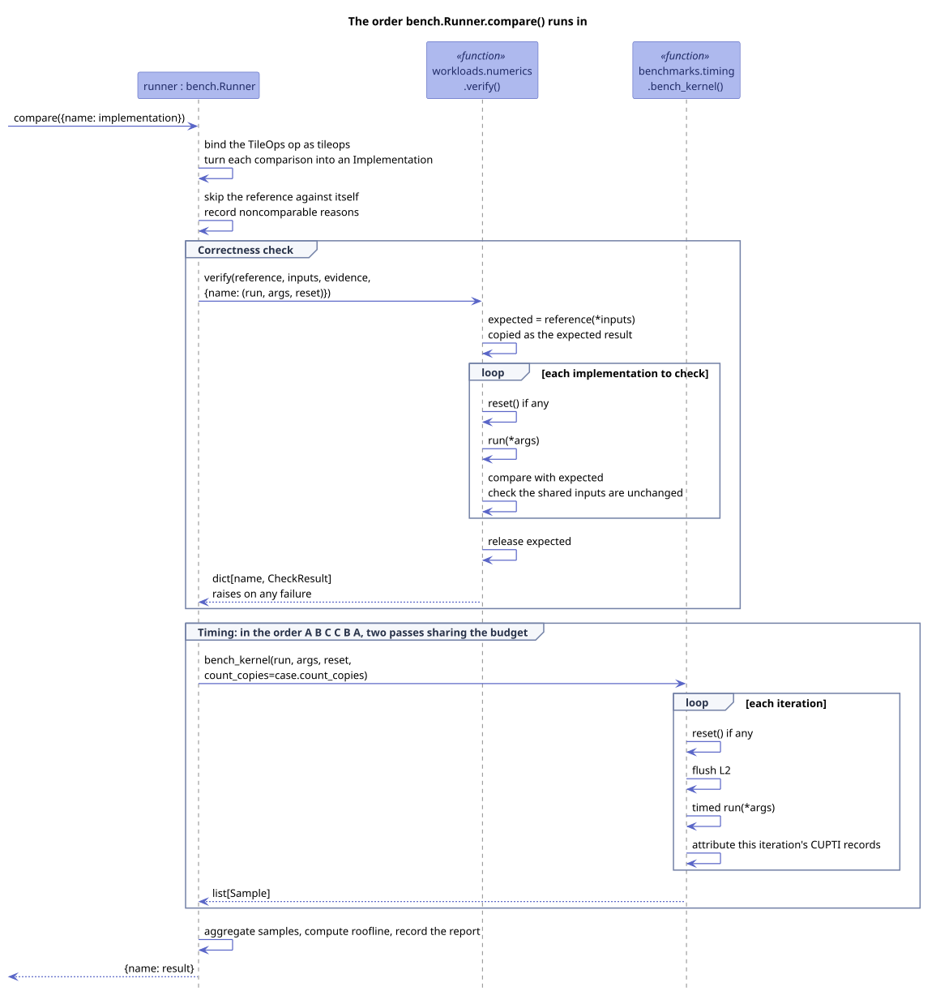
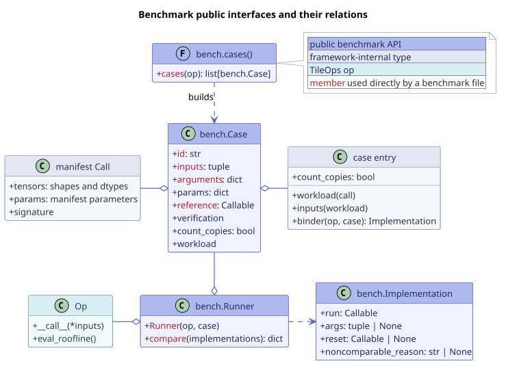

# Writing benchmarks

A benchmark for a manifest op centers on one call:

```python
bench.Runner(op, case).compare(implementations)
```

Here, `op` is the TileOps implementation, which appears as `tileops` in the report.
`case` represents one workload call from the manifest and comes from `bench.cases(Op)`.
`implementations` contains the other implementations you want to compare with TileOps.

Before timing begins, `compare()` checks each implementation against the case's
reference. It then writes one report row for each implementation. The four public
interfaces are defined in
[`benchmarks/api.py`](https://github.com/tile-ai/TileOPs/blob/main/benchmarks/api.py):

| Interface | Kind | What it does |
| --- | --- | --- |
| `bench.cases(Op)` | function | Creates a list of `bench.Case` objects from the op's manifest workload rows. |
| `bench.Case` | class | Holds the inputs, op constructor arguments, reference, numerical check, and copy policy for one benchmark. |
| `bench.Runner` | class | Checks, times, and records the TileOps implementation and the implementations being compared with it. |
| `bench.Implementation` | class | Describes an implementation that needs private arguments or state restoration, or cannot be compared numerically. |

To write a benchmark, you usually add a test function in `benchmarks/ops/`, register a
case for the op in `benchmarks/_cases/`, and choose the implementations to compare. The
next three sections walk through these steps.

## Example {#example}

This example compares TileOps batched matmul with vLLM, SGLang, and PyTorch/cuBLAS:

```python
import pytest

from benchmarks import api as bench
from tileops.ops import BmmFwdOp


@pytest.mark.parametrize("case", bench.cases(BmmFwdOp), ids=lambda case: case.id)
def test_bmm_bench(case, vllm_bmm, sglang_bmm):
    op = BmmFwdOp(**case.arguments)

    bench.Runner(op, case).compare(
        {
            "vllm": vllm_bmm,
            "sglang": sglang_bmm,
            "torch-cublas": case.reference,
        }
    )
```

Here is how the example works:

- `bench.cases(BmmFwdOp)` creates a case for each dtype case of every manifest workload
  row. The `case.id` also serves as the pytest test ID.
- `case.arguments` supplies the arguments used to construct the op.
- `vllm_bmm` and `sglang_bmm` are callables that accept the same inputs as the op.
  `Runner` calls them with `case.inputs`.
- The mapping keys appear unchanged in the report. The name `tileops` is reserved for
  the op. If you pass one implementation instead of a mapping, it appears as `baseline`.
- Passing `case.reference` under the name `"torch-cublas"` lets it produce the expected
  result and take part in the timing comparison.

Benchmark files run under pytest. With `--tileops-verify`, pytest runs the correctness
check without timing. This is useful for checking numerical results after a kernel change:

```bash
python -m pytest benchmarks/ops/bench_bmm.py
python -m pytest benchmarks/ops/bench_bmm.py --tileops-verify
```

The validator's `bench` level checks that every benchmark file in `benchmarks/ops/`
calls both `bench.cases` and `bench.Runner`.

## Registering a case {#register}

To turn a manifest call into a workload, `bench.cases()` looks up the op's entry in
[`benchmarks/_cases/`](https://github.com/tile-ai/TileOPs/tree/main/benchmarks/_cases).
Each manifest op has one entry in the module for its family. For most ops, the entry is
just one line. Here is an excerpt from `_cases/gemm.py`:

```python
ENTRIES = {
    "BmmFwdOp": Entry(BmmWorkload.from_call),
    "GemmFwdOp": Entry(GemmWorkload.from_call),
}
```

The first argument to `Entry` builds the workload from a manifest call. You only need
the other arguments in specific cases:

| Argument | Default | When to set it |
| --- | --- | --- |
| `inputs` | The workload's `gen_inputs()` supplies the inputs. | The op needs different call-time inputs, such as a backward op that needs tensors saved by a forward pass. |
| `count_copies` | `False` | The op produces its result through a device-to-device copy inside `run`, as in-place elementwise ops and MoE write-back do. See [How a benchmark is timed](../../timing.md#when-to-change). |
| `binder` | The op is called with `case.inputs`. | The op needs a different calling convention, such as trimming its return value, writing output to a private buffer (as MoE ops do), or restoring its state. |

Because `count_copies` belongs to the entry, every implementation in a case follows
the same timing policy. A custom `binder` changes how `Runner` calls the op, while the
benchmark file still passes the original `op`. If an op has no entry, pytest fails when
it collects the cases.

## Passing implementations {#implementation}

Most implementations only read their inputs, so you can pass them as plain callables.
`Runner` calls each one with `case.inputs`. Passing `fn` is equivalent to passing
`bench.Implementation(run=fn)`.

For a fair comparison, every timed round must start with the same input data. An
implementation therefore cannot modify the shared `case.inputs`; if it does,
`compare()` raises an error before timing begins. Use `bench.Implementation` for a
library function that writes to an argument in place or carries state between calls.
For example, `vendor_add` computes `x + y` but writes the result into `y`:

```python
from benchmarks import api as bench

x, y = case.inputs
private_y = y.clone()


def vendor_add(x, y):
    return y.add_(x)


def reset_vendor_inputs():
    private_y.copy_(y)


vendor = bench.Implementation(
    run=vendor_add,
    args=(x, private_y),
    reset=reset_vendor_inputs,
)

bench.Runner(op, case).compare({"vendor": vendor})
```

In this example:

- The values in `args` follow the signature of `run`. With `args=None`, `run` receives
  `case.inputs`. With `args=()`, it receives no arguments, as a closure would require.
- Only overwritten arguments need private copies and restoration through `reset`.
  Other arguments can use tensors from `case.inputs`. Here, only `y` needs a copy.
- `reset` runs before each correctness call and before each timed round's L2 flush, so
  its work does not count toward the measurement. [Timing](#timing) explains why this
  order matters.

### Implementations that are not numerically comparable {#noncomparable}

An external implementation may have different semantics from the case, while its
performance is still useful to record. In that situation, give the reason on the
implementation:

```python
vendor = bench.Implementation(
    run=vendor_fn,
    noncomparable_reason="vendor uses different rounding semantics",
)
```

`Runner` times this implementation as usual and checks that it leaves the shared inputs
unchanged, but skips the numerical check. The report records the reason and omits the
ratio against TileOps. An empty reason, or this field on the TileOps implementation,
causes an error before timing.

Use this field only for differences in semantics. A numerical error beyond tolerance
is a failed check, not a semantic difference.

## Inside compare() {#compare}



`compare()` gets the TileOps implementation from the binder and converts each comparison
implementation to a `bench.Implementation`. It then checks correctness, times the
implementations, aggregates the samples, computes the roofline, and writes the report.

### Correctness check {#verify}

`case.reference` runs once per `compare()` and produces the expected result. TileOps
and every other implementation are checked against that result, rather than
against one another:

```text
TileOps op  ↔ case.reference
vLLM        ↔ case.reference
SGLang      ↔ case.reference
```

Before each implementation runs, its `reset` runs. Afterwards, `Runner` checks whether
the shared inputs changed. If any check fails, the comparison stops before timing.

The workload determines how outputs are compared. Its `verification()` returns one of
the declarations in
[`workloads/numerics.py`](https://github.com/tile-ai/TileOPs/blob/main/workloads/numerics.py).
Some cases cannot be checked numerically, and the report shows which rows were:

| Declaration | What is checked | In the report |
| --- | --- | --- |
| `Exact` | All outputs are compared. | The report includes a normal row and a ratio. |
| `Partial` | Only the first few outputs are compared. | The report notes which outputs were not checked and includes a ratio. |
| `Custom` | A case-specific assertion checks the outputs. | The report notes how they were checked and includes a ratio. |
| `Unestablished`, `ReferenceInfeasible`, `Noncomparable` | No numerical comparison is made. | The report marks the row as unverified and omits the ratio. |

If the reference runs out of memory, every implementation in that case is also marked
unverified. A row with timing results is therefore not necessarily verified. Check its
unverified mark and whether it has a ratio.

Two kinds of implementation are never checked numerically:

- An implementation with `noncomparable_reason` set; see
  [Implementations that are not numerically comparable](#noncomparable).
- The reference itself, when `run` is `case.reference`, `args` is `None`, and there is
  no `reset`. Checking it against itself would prove nothing, so it inherits the TileOps
  implementation's status. A wrapper around the reference, a call with different
  arguments, or a compiled version is a separate implementation and is checked as usual.

### Timing {#timing}

`benchmarks.timing.bench_kernel()` handles calibration, warm-up, the L2 flush, sampling,
and CUPTI recording. `Runner` determines the order in which implementations are timed.
Each implementation is timed twice in the order A B C C B A, with the time budget split
between the two passes. [How a benchmark is timed](../../timing.md#comparing) explains
why this order is used.

Every calibration, warm-up, and sampling round follows this sequence:

```text
reset → flush L2 → timed run(*args)
```

This sequence ensures that:

- Every round starts with the same input data.
- Restoring state does not add to the measurement because the CUDA copies issued by
  `reset` are not attributed to that round's CUPTI records.
- Restored data does not remain in L2. If `reset` ran inside the timed function, the
  inputs it rewrites would be warm in L2, giving that implementation a cache advantage.

`count_copies` controls whether copies inside `run` count toward the measurement.
`reset` always runs outside the timed region. If you want to time a single call without
a case or a correctness check, you can call `bench_kernel` directly. See
[How a benchmark is timed](../../timing.md#how-it-runs) for its usage and the meaning
of each measurement.

## bench.Case {#case}

A `bench.Case` holds the information needed for one benchmark:

| Attribute | Meaning |
| --- | --- |
| `id` | A stable identifier used by pytest and the report. |
| `inputs` | The call-time inputs, ordered according to the op's signature. |
| `arguments` | The keyword arguments used to construct the op. |
| `params` | The tensor shapes, dtypes, and manifest parameters written to the report. |
| `reference` | The callable that produces the expected result. |
| `verification` | The workload's rules for checking outputs; see [Correctness check](#verify). |
| `count_copies` | Whether device-to-device copies inside `run` that are part of the op count toward the measurement. This is set in the case entry. |
| `workload` | The workload that generates `inputs`. An implementation can read derived data here, such as an attention window, chunk boundaries, or preprocessed weights. |

A case creates its data on first access and releases it when the test ends, so pytest
can collect cases without a GPU. The correctness check and timing use the same tensors.
As a result, the TileOps implementation, the reference, and the report parameters all
correspond to the same case.

## Who owns what {#layers}



The information used by a benchmark comes from several layers:

| Layer | Responsibility |
| --- | --- |
| manifest | Defines the op signature, side effects, model workloads, and roofline. |
| workload (`workloads/`) | Defines the input data distribution, reference, and numerical check. |
| case entry (`benchmarks/_cases/`) | Builds a case from a workload and defines its copy policy and how the TileOps implementation is called. |
| `bench.Runner` | Handles checking, timing order, roofline computation, and reporting. |
| tests (`tests/`) | Cover kernel branches, edge cases, and numerical regressions. |

Benchmarks only read calls from the manifest. They do not add fields to it for a
benchmark or a particular implementation. Manifest workloads describe model scenarios
and help track performance over time; they are not meant to exercise every kernel
branch. Tests cover implementation paths and edge cases. They can reuse a workload's
data and numerical rules without going through `bench.cases()`.

## FAQ {#faq}

**An implementation overwrites one of its arguments. Can't `Runner` just clone all the
inputs?**

`Runner` does not clone the inputs. Cloning would lose aliasing or view relationships
between them and could not capture state outside the inputs. Instead, the implementation
passes a private copy of the overwritten argument in `args` and restores it in `reset`.
See [Passing implementations](#implementation) for an example.

**Only one implementation copies data inside `run`. Can the copies count for just that
one?**

`count_copies` applies to the whole case and is set in its entry. If implementations
chose their own copy policies, rows in the same table would follow different timing
rules, and their ratios would no longer be meaningful.

**The TileOps op needs a wrapper before it can take `case.inputs`. Can I pass the wrapper
to `Runner`?**

`Runner` finds the op in the manifest by its class name and uses that name in the
report. Passing a wrapper or subclass therefore raises an error when `Runner` is
constructed. Put the adaptation in the `binder` of the op's case entry.
