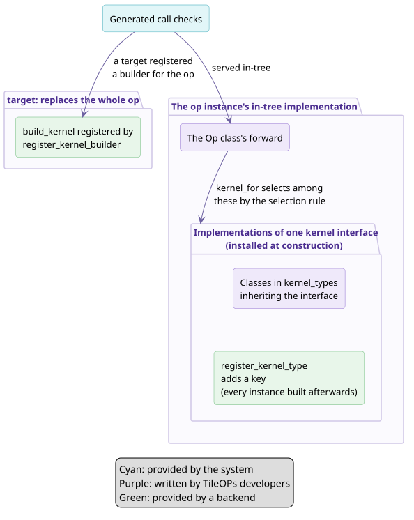

# backend 如何接入 TileOPs

第三方 backend 按要接管的调用范围，从小到大有两种方式：为一个 kernel 接口新增实现、替换整个 op。第一种方式中 backend 的类与 in-tree 实现遵守同一份 kernel 接口，写法见[如何为 op 新增 kernel](writing.md)。

## 1. 按要接管的调用范围选择接入方式 {#choose}



**图 1** 两种扩展方式各自接管的范围。青色为系统提供的部分，紫色为 TileOPs 开发者编写的部分，绿色为 backend 提供的部分。

**表 1** 两种方式的比较

| No. | 项目 | `register_kernel_type` | target |
| --- | --- | --- | --- |
| 1 | 改变什么 | 新增一个 key，带有它自己的适用范围与优先关系 | op 的全部调用，所有写入张量都为空的调用除外 |
| 2 | 作用于 | 注册之后构造的所有该 op 实例 | 选中该 target 的 op 实例 |
| 3 | 依据的契约 | kernel 接口 | manifest 中 op 的签名 |
| 4 | 新类不服务的调用 | 仍由 in-tree 实现服务 | 不存在，target 服务全部调用，所有写入张量都为空的调用除外 |

## 2. 新增实现：register_kernel_type {#register}

`tileops.backend.register_kernel_type(op, key, kernel_type)` 为 op 新增一个实现，是[如何为 op 新增 kernel](writing.md) 第一步的 backend 形式。`op` 是 op 的类名，`key` 是新实现的名字，`kernel_type` 是同时继承 `Kernel` 与 op 的某个 kernel 接口的类，属于哪个接口由继承关系决定，由它自己的类方法 `entry_for(call)` 构建。第二步与 in-tree 实现相同。

```python
# tests/test_kernel_dispatch.py
class _TorchLayerNorm(Kernel, LayerNormFwdInterface):
    """A replacement written against ``LayerNormFwdInterface`` alone."""

    devices = frozenset({torch.device(run_device()).type})

    def __init__(self, n: int, eps: float) -> None:
        super().__init__()
        self.n, self.eps = n, eps

    @classmethod
    def entry_for(cls, call: LayerNormCall):
        return (call.n, call.eps), lambda: cls(call.n, call.eps)

    def forward(self, x, weight, bias):
        return F.layer_norm(x.float(), (self.n,), weight.float(), bias.float(), self.eps).to(
            x.dtype
        )


class _NarrowTorchLayerNorm(_TorchLayerNorm):
    """An added implementation for short rows, which wins over the in-tree one there."""

    preferred_over = frozenset({"layer_norm"})

    @classmethod
    def refusal(cls, call: LayerNormCall) -> "str | None":
        return None if call.n <= 256 else "serves rows of at most 256"

register_kernel_type("LayerNormFwdOp", "torch_short_rows", _NarrowTorchLayerNorm)
```

- 新实现在 `n <= 256` 上与 `LayerNormKernel` 重叠，后者不是 general，因此新实现声明 `preferred_over`。
- 新实现不服务的调用仍由 in-tree 实现服务，例如 `n = 1024`。
- 新实现只进入注册之后构造的 op 实例。
- 同一个 op 下重复注册同一个 key 报 `BackendError`；key 与 in-tree 的 key 相同时，构造 op 时报 `reuse keys it has`。
- 新实现不继承 op 的任何 kernel 接口、`entry_for` 不是类方法、或 `forward` 不接受接口的参数时，构造 op 时报错，见[如何为 op 新增 kernel § 5](writing.md#tests)。

注册在 backend 模块被导入时完成。backend 在 `pyproject.toml` 中声明 entry point，TileOPs 在构造第一个 op 时导入它：

```toml
[project.entry-points."tileops.backends"]
acme = "tileops_acme"
```

模块导入失败时，它的全部注册被撤销，TileOPs 发出 `RuntimeWarning`，失败记录可以通过 `tileops.backend.load_failures()` 查看。

## 3. 替换整个 op：target {#target}

target 协议的完整写法、一个可运行的模板 backend 与常见报错，见[接入新的硬件 backend](../../backends.md)。本节只概述它与另一种方式的区别。

target 是 backend 为一组 kernel 取的名字。target 为某个 op 注册 builder 之后，选中该 target 的 op 实例的调用都由 target 服务，op 自己的 `forward` 不执行。一次调用写入的所有张量都为空时例外：这时 target 与 in-tree 实现都不执行，输出按签名构造。

```python
from tileops.backend import TensorSpec, register_detector, register_kernel_builder
from .kernels import AcmeRMSNorm

register_detector(target="acme", detect=lambda device: device.type == "acme")

def build_rms_norm(x: TensorSpec, weight: TensorSpec | None, *, normalized_shape, eps):
    return AcmeRMSNorm(normalized_shape, eps, x.dtype)

register_kernel_builder(op="RMSNormFwdOp", target="acme", build_kernel=build_rms_norm)
```

- `build_kernel` 按 op 的 `signature.inputs` 顺序接收每个输入的 `TensorSpec`（未传入的可选输入为 `None`，例如 `RMSNormFwdOp` 的 `weight`），并以关键字接收 `signature.params`。它返回的 kernel 在调用时按同样的顺序接收输入张量，并以关键字接收调用方传入的输出缓冲与执行参数。导入模块时不编译任何东西，构建在 `build_kernel` 被调用时发生。
- op 实例按调用设备，以及每个输入是否传入、dtype 与 shape，缓存 `build_kernel` 返回的 kernel。
- op 实例在第一次需要执行实现的调用中确定 target，此后不变：构造参数 `target=` 优先，其次是 `set_default_target` 设置的进程默认值，最后由各 target 的 detector 检测调用设备；没有 target 认领时使用 in-tree 实现，多个 target 认领时报 `AmbiguousTargetError`。写入张量都为空的调用不确定 target；确定 target 的那次调用失败时，选择被撤销，下一次调用重新确定。
- 传给 target 的调用已经通过由签名生成的检查；除声明了 `device: cpu` 的张量外，所有张量位于调用设备上；所有不被写入的输入都是连续的，被写入的输入在声明了 `contiguous: true` 时是连续的。
- 选中的 target 没有为这个 op 注册 builder、而 op 自己持有 kernel 时，调用报 `OpNotAvailableError`，不退回 in-tree 实现。
