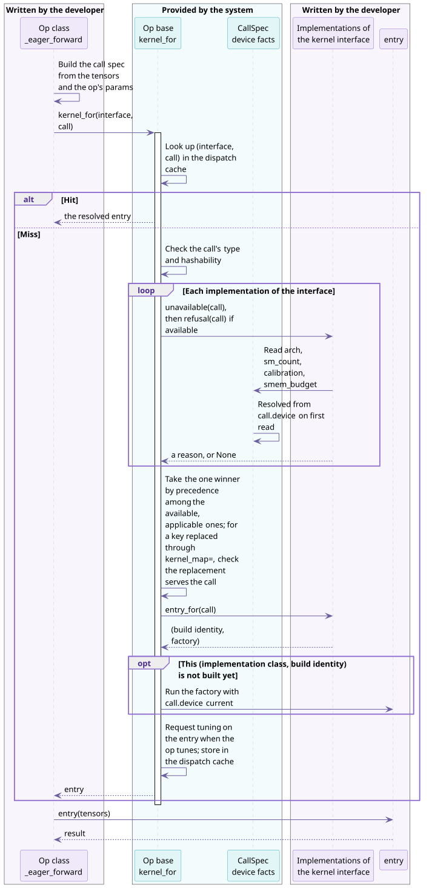

# How an op selects a kernel

A TileOPs op can have several kernels, and each kernel serves part of the op's calls. This guide describes how an op selects a kernel on a call, and what a developer writes to add a kernel. It is written for two readers: developers who add a kernel or an op to TileOPs, and authors of third-party backends who replace or add kernels. The reasons behind each design choice are in the design document [Op Interface Design § Kernel selection](../../design/ops-design.md#kernel-selection).

This page describes the selection process and its terms. The other two pages are:

- [Adding a kernel to an op](writing.md): the two steps, the default rules, opening a new kernel interface, tests, and common errors;
- [How a backend joins TileOPs](backends.md): `kernel_map=`, `register_implementation`, and targets.

## 1. Who selects the kernel: the op selects an interface, dispatch selects an implementation {#two-levels}

The op first selects a **kernel interface** by semantics. Dispatch then selects one of that interface's **implementations** by the call's shape, dtype, and device.

**Table 1** The op selects an interface, dispatch selects an implementation

| No. | Level | Decided by | Based on | Written in |
| --- | --- | --- | --- | --- |
| 1 | Select a kernel interface | the op | semantics, that is, where the call contracts differ, such as training versus inference | the op's `_eager_forward`, which names the interface when it calls `kernel_for` |
| 2 | Select an implementation | dispatch, shared by all ops | the availability, applicability, and precedence each implementation declares | the selection algorithm is in `src/tileops/ops/op_base.py`; each implementation's declarations are on its own kernel class |

Take `BatchNormFwdOp` as an example. The op selects the interface `batch_norm_fwd_train` or `batch_norm_fwd_infer` by its construction argument `training`. The training interface has four implementations, and dispatch selects one of them by batch size, channel count, and spatial size.

## 2. How a call finds its kernel {#call-path}

On every call, the op builds a **call spec**, which records the facts of this call that affect selection and building. It then calls `self.kernel_for(interface, call)`:

```python
# src/tileops/ops/norm/layer_norm.py
call = LayerNormCall(device=x.device, n=math.prod(ns), eps=self.eps, dtype=x.dtype)
return self.kernel_for("layer_norm", call)(x, weight, bias)
```



**Figure 1** The hit and miss paths of one `kernel_for` call. Purple marks the parts written by the developer; teal marks the parts provided by the system.

- **Hit**: one cache lookup by `(interface, call)` returns the resolved entry directly. No implementation is consulted and no device property is read.
- **Miss**: dispatch selects in the following order and writes the result to the cache:
  1. Drop the implementations that cannot run on the call's device, based on `devices` and `supported_archs`.
  2. Drop the implementations that do not serve this call, based on `applies` or `refusal`.
  3. Pick the single winner among the rest: a `general` implementation ranks below every other implementation, and the others are compared by `preferred_over`.
  4. Call the winner's `entry_for(call)` to get a build identity and a factory, then build or reuse the entry. Within one interface, calls share an entry only when they select the same implementation class with the same build identity. An entry can contain one or more kernels.

When no key can run on the call's device type, the call raises `in-tree kernels do not run on` (`OpNotAvailableError`). When some key supports the device type but no implementation is both available and applicable, it raises `no implementation serves this call`. When several implementations remain with no precedence among them, it raises `dispatch is ambiguous`. Selection does not depend on declaration order, and there are no numeric priorities.

## 3. Two things to do when adding a kernel {#hooks}

To add a kernel to an existing kernel interface, TileOPs developers and backend authors both do the following two things:

**Table 2** The two steps of adding a kernel

| No. | Step | TileOPs developer | Backend author | Described in |
| --- | --- | --- | --- | --- |
| 1 | Register the implementation | the class subclasses the kernel interface and is added to the op's `kernel_types` | the class subclasses the kernel interface; call `register_implementation(op, key, cls)` | [Adding a kernel to an op § 1](writing.md#register) |
| 2 | Declare which calls the implementation serves | write `applies`; write `preferred_over` only when it overlaps another non-general implementation | same as the TileOPs developer | [Adding a kernel to an op § 2](writing.md#rule) |

An implementation that declares none of `devices`, `supported_archs`, `applies`, `general`, and `preferred_over` is available on CUDA devices of every architecture, serves every call, and has no precedence relation with other implementations. An interface with a single implementation therefore only needs the class to subclass the interface.

A backend can also replace the implementation behind an existing key, or replace a whole op; see [How a backend joins TileOPs](backends.md).

## 4. Terms used in this guide {#terms}

**Table 3** Terms

| No. | Term | Meaning | Written in code as |
| --- | --- | --- | --- |
| 1 | kernel interface | a place where an op calls a kernel, which fixes the call contract at that place | a subclass of `KernelInterface`; the op's `interfaces` |
| 2 | implementation | a kernel class that subclasses a kernel interface, registered under a key | a `Kernel` subclass; a key of `kernel_types` |
| 3 | call spec | the immutable facts of one call that affect selection and building | a frozen dataclass subclass of `CallSpec` |
| 4 | device facts | the architecture, the SM count, the calibrated board model the device belongs to, and the shared memory limit per block, read from the call's device only on a miss | `arch`, `sm_count`, `calibration`, `smem_budget` |
| 5 | availability | which devices the implementation can run on | `devices`, `supported_archs` |
| 6 | applicability | which calls the implementation serves | `applies`, `refusal` |
| 7 | precedence | which implementation is selected when several are available and applicable | `general`, `preferred_over` |
| 8 | build identity and entry | the value that decides whether two builds are the same, and the entry built from it, which contains one or more kernels | the pair returned by `entry_for` |
