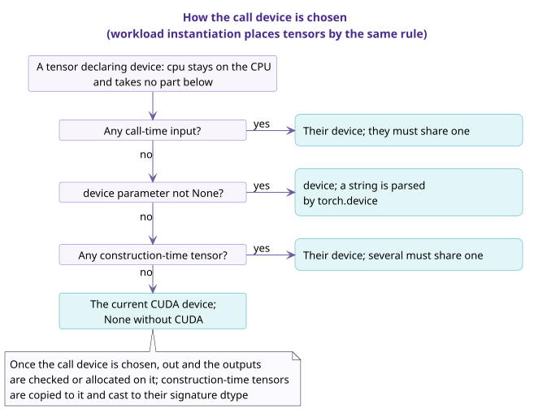

# Calls and validation

A call has two phases, construction and call, and the checks in both phases are generated from the signature. The validator runs static checks on the signature in CI to ensure that every spec can generate these checks. This page describes the checks run during a call, the kernel selection rules, the validator's checks, and the forms rejected in `shape_rules`.

## 1. The two phases of a call {#call}

In the **construction** phase, the op checks parameter values against their `type` (including whether a dtype parameter is in the allowed set), checks that every non-optional construction-time tensor is given, and checks the `invariant` of ADTs. The following are fixed at construction:

- the values of `Bool`, enum and ADT parameters;
- whether `Maybe` parameters and construction-time tensors are given;
- the indices solved from the shapes and dtypes of construction-time tensors, and the `let` entries computable from these.

Checks such as non-negative axes, refinements and `invariant` run at construction when they can already be evaluated there, and are deferred to call time otherwise.

In the **call** phase, the checks generated from the signature around `forward` run in the following order:

1. determine whether each call-time tensor is passed;
2. check domain restrictions;
3. select type family branches;
4. infer indices, and check the remaining refinements;
5. check the preconditions of output buffers;
6. run the implementation;
7. check the outputs: the number of outputs and whether each is `None`, shape, dtype, device and memory layout; `out` and `alias` outputs must be the corresponding tensor objects, and other outputs must not share storage with inputs.

When any check fails, the op raises an error that names the unsatisfied declaration.

If every tensor a call writes (each output and each written input) has no elements, step 6 runs no implementation: new outputs are created on the call device with the checked shapes and dtypes, and `out` and the written inputs are returned unchanged. When the inputs are empty but the outputs are not, the implementation runs as usual.

## 2. Kernel selection {#selection}

An op declares in `interfaces` the positions where it calls kernels, and each position corresponds to a kernel interface. An implementation of a kernel interface is a kernel class that inherits it. At call time, the op constructs a call spec and calls `kernel_for(interface, call)` to obtain an entry. Each distinct call spec is looked up only once. When a call spec first appears, the Op base class selects exactly one implementation in the following order:

1. availability: the implementation's `devices` and `supported_archs`;
2. applicability: the implementation's `refusal`;
3. precedence: the implementation's `general` and `preferred_over`.

The selected implementation's `entry_for(call)` gives the build identity and the factory. The signature declares only the requirements of the algorithm itself, and the restrictions of each implementation are written in that implementation's own declarations.

The selection rules, how to add a kernel, and how a backend joins are in [How an op selects a kernel](../dispatch/index.md).

## 3. type inference {#inference}

The construction phase first solves the indices that construction-time tensors determine, and the call phase then solves the remaining indices from the call-time tensors actually passed. The validator fixes the solving order in advance, independent of the order in which declarations are written.

**Table 1** Unification rules for input axes

| No. | Axis form | unification |
| --- | --- | --- |
| 1 | `M`, with `M` unknown | `M :=` actual axis length |
| 2 | `a * M + e`, where `a` is a known positive integer constant, `e` is known, and `M` is the only unknown | `M := (actual axis length - e) / a`, checking that the division is exact and the result is non-negative |
| 3 | `*S`, where `S` is the only unknown part of the shape and the number of other axes is known | `S :=` the tuple of the corresponding axes |
| 4 | `dtype` is an unknown `DType` index `T` | `T :=` actual dtype |
| 5 | any other form | only checks that the equality holds |

**Table 2** Indices solved from declarations

| No. | spec | Declaration | Solved index |
| --- | --- | --- | --- |
| 1 | SiluAndMul | `x: "[M, 2 * N]"` | `N`, also checking that the axis length is even |
| 2 | GQA varlen | `cu_seqlens_q: "[B + 1]"` | `B` |
| 3 | GemmW4A16 | `activation: "[M, K]"`, `packed_weight: "[N, K // 2]"` | `K` is solved from `activation`; `K // 2` in `packed_weight` is used only for checking |

- Every `Dim`, `Shape` and `DType` index used on a branch must be solvable from the inputs or given by a parameter. An index that appears only in outputs must be a parameter or a `let`.
- A generator generates the values of metadata tensors only at workload instantiation, and helps determine the indices a workload row does not write; in an actual call, these indices are likewise solved from the tensors passed.
- If an index cannot be solved, or has more than one solution, the validator rejects the spec.
- For the output buffer `out`, the inference phase only determines whether it is passed; once the output type is fixed, `out` is checked against it.
- If the relation between an axis length and a logical dimension is not affine, a name can stand for the physical axis and a `let` computes the logical dimension. For example, MHCPre writes `b: "[Q]"` and `let: {n: "mhc.expansion(Q)"}`.

## 4. Call device {#device}

The call device is determined as shown below. At workload instantiation, tensors are placed by the same rules.

- A tensor that declares `device: cpu` is always on the CPU and does not take part in deciding the call device; among construction-time tensors, too, only those that do not declare `device: cpu` take part.
- When there is no call-time tensor, no `device` parameter and no construction-time tensor that takes part, the call device is the current CUDA device, or `None` when CUDA is unavailable. By design, before this step an explicitly given or process-default target selects a device within the device categories it declares; this step is not implemented yet.
- Once the call device is determined, `out` and each output are checked or allocated on that device.
- A construction-time tensor that does not declare `device: cpu` is copied to the call device at call time and converted to the dtype in the signature.
- For a tensor that declares `contiguous: true`, the generated checks confirm that it is contiguous in memory; tensors generated by workload instantiation are always contiguous.

## 5. torch.compile and SymInt {#symint}

Under `torch.compile`, the generated checks are evaluated on SymInt, and each discriminant is already a concrete Python value at that point.

- An expression that needs to convert a SymBool to a Python boolean is evaluated only at construction.
- An op class can declare a compile boundary, meaning it supports `fullgraph=True`. For such a class, the validator requires every expression to be evaluable on SymInt.
- Expression strings are parsed and checked before code generation, and the generated code does not parse strings at run time.

The conventions a caller follows under `torch.compile` are in [Bringing an op into torch.compile](../../torch-compile.md).

## 6. The validator's checks {#validator}

[`scripts/validate_manifest.py`](https://github.com/tile-ai/TileOPs/blob/main/scripts/validate_manifest.py) checks each spec on every combination of discriminant values. The quantities that take part in the combinations are:

- the `match` of type families;
- `optional` and `nullable`;
- `mutated`;
- whether output buffers are passed;
- the quantities involved in deciding whether an index is used.

For combinations excluded by a domain restriction, the validator skips only two checks: type family coverage and the solving order. If a spec has more value combinations to check than the configured limit (256 by default), the validator issues an advisory-level notice but still checks the spec in full.

On each value combination, the validator checks the following:

1. The category of each name matches its kind, and the `type` of each parameter is compatible with the kind required at each place it is used.
2. The `cases` of each type family have no gaps and no overlaps over the accepted values, and references between type families have no cycle.
3. Every index can be solved (see [§ 3](#inference)).
4. Dependencies between `let` entries have no cycle.
5. Every expression belongs to the expression language, and every primitive used is built in.
6. On every workload row, the generator results unify with their declarations and every `requires` holds.
7. For a class that declares a compile boundary, every expression can be evaluated on SymInt.
8. Every workload row can be instantiated.
9. On each effect branch, the operator schema, the aliasing and the roofline read and write counts agree.

For an `implemented` op, the validator also checks that the code agrees with the spec, including `__init__` against `params`, `forward` against the call-time inputs, and composition against the class's `delegate_types` and `kernel_types`. `spec-only` ops skip these code-dependent checks.

- CI runs the validator on the whole manifest.
- The validator parses a spec field by field. When a field cannot be parsed, the validator reports that field and skips only the checks that depend on it; the other checks run as usual.
- When an op is imported, the manifest is loaded in lenient mode, so the op imports normally even if the manifest is incomplete; strict checks are run only by the validator.

## 7. Rejected forms {#rejected}

`shape_rules` contains only refinements. Forms that also act as a shape declaration, a name definition or a presence test are rejected:

**Table 3** Rejected forms and their rewrites

| No. | Rejected form | Example | Rewrite as |
| --- | --- | --- | --- |
| 1 | reading a tensor's `shape` | `x.shape == (B, S, H, D)` | declare the shape on the tensor: `x: {shape: "[B, S, H, D]"}` |
| 2 | an equality stating that two tensors have the same shape | `output.shape == input.shape` | the two tensors use the same shape term, such as `[*S]` |
| 3 | an equality defining a new name | `C_in_g == C_in // groups` | `let: {C_in_g: "C_in // groups"}` |
| 4 | `x is None` on a tensor | `bias is None or ...` | `not present(bias) or ...` |
| 5 | `v is None` on a value | `max_seqlen is None` | `not present(max_seqlen)` |
| 6 | `isinstance` | `s[0] if isinstance(s, tuple) else s` | `per_axis(s, 0, 2)` |
| 7 | a set comprehension | `len({d % n for d in dim}) == len(dim)` | `unique_axes(dim, n)` |
