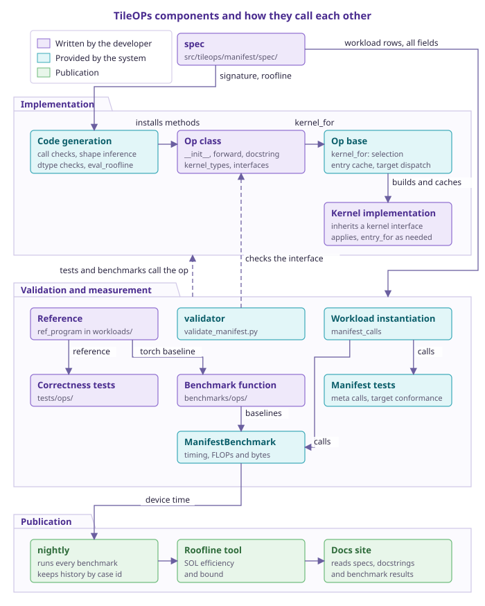
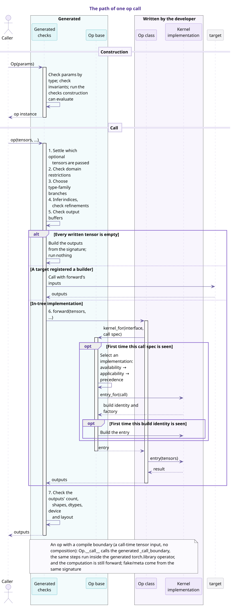
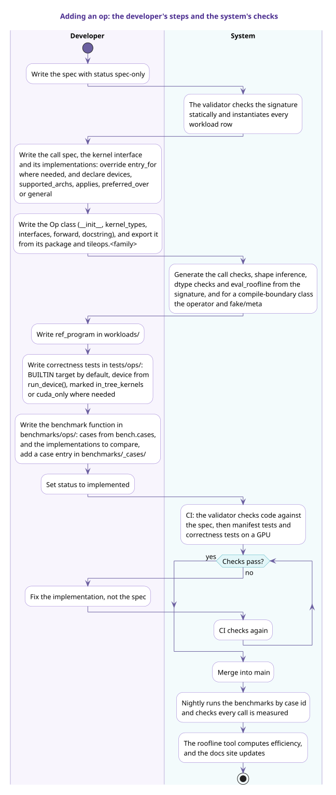

# 读写 manifest

manifest 描述 TileOPs 每个 public op 的外部契约，由 [`src/tileops/manifest/spec/`](https://github.com/tile-ai/TileOPs/tree/main/src/tileops/manifest/spec) 下的 YAML 文件组成。每个 op 在 manifest 中占一个条目，这个条目称为该 op 的 **spec**。op 的实现以 spec 为依据，validator 在 CI 中检查实现与 spec 是否一致；两者不一致时，修改的是实现。

开发者为一个 op 写好 spec 之后，以下内容都由系统根据 spec 生成：

- 构造与调用时的检查、输出形状推导与 dtype 检查；
- manifest 测试与 benchmark 所用的调用及其输入；
- 每次调用的 FLOPs 与字节数；
- 文档站中取自 spec 的内容，例如支持矩阵。

开发者需要编写的是：

- kernel；
- op 类，包括 `__init__`、`forward` 与 docstring；
- 数值参考与正确性测试；
- benchmark 的对比基线。

本页前三节依次说明系统由哪些组件组成、一次调用如何执行，以及新增一个 op 的完整流程。

## 1. 系统概览 {#overview}

TileOPs 的组件分为四层：

1. 声明层：spec。
1. 实现层：由 spec 生成的代码，以及开发者编写的 op 与 kernel。
1. 验证与测量层：测试、benchmark 与 validator。
1. 发布层：nightly、roofline 工具与文档站。

下图中紫色的组件由开发者编写，青色的组件由系统提供，浅绿色的组件属于发布层。

**表 1** 开发者编写的部分

| No. | 部分 | 位置 | 内容 |
| --- | --- | --- | --- |
| 1 | spec | `src/tileops/manifest/spec/<family>.yaml` | 签名、workload 行、roofline 公式 |
| 2 | kernel 接口与实现 | `src/tileops/kernels/`；kernel 接口与 call spec 通常放在 family 的 `call_spec.py` 中，只有一个 kernel 文件的 family 写在该文件里 | kernel 接口规定 call spec 的类型与 `forward` 的参数；实现是 `Kernel` 的子类，并继承相应的 kernel 接口。默认的 `entry_for(call)` 直接用 call spec 构造实现，不能准确表示构造参数时再覆写它 |
| 3 | Op 类 | `src/tileops/ops/`，并由 `tileops.<family>` 导出 | 与 `params` 一致的 `__init__`；`kernel_types`（键到实现类）与 `interfaces`（调用位置到 kernel 接口）；在 in-tree 实现中（通常是 `_eager_forward`，见下文 compile boundary）构造 call spec，并通过 `kernel_for` 取得要调用的 entry；Google 风格的 docstring，文档站的 API 参考由它生成 |
| 4 | 参考实现 | `workloads/` | 以该 op 命名的 workload 类，或 family 共用的参数化 workload 类上的 `ref_program`，以及 workload 行无法确定的输入构造 |
| 5 | 正确性测试 | `tests/ops/` | 数值容差，以及覆盖 kernel 各分支所需的形状 |
| 6 | benchmark 函数 | `benchmarks/ops/` 中该 op 所属模块的 benchmark 文件，没有合适的文件时再新增 | 以 `manifest_calls(Op)` 参数化测试函数，并选择对比基线，例如 torch 参考实现与其他库的 kernel |

以下几项只在需要时编写：

- 内联公式无法表达代价时，在 `tileops.perf.formulas` 中编写 roofline `func`；
- op 的 FLOPs 属于矩阵乘收缩、最优实现应使用 tensor core 时，覆写 `compute_roof()`。它表示最优实现应当使用的计算单元，与当前 kernel 实际使用的单元无关；
- 同一个 kernel 接口有多个实现时，在各实现上声明它服务哪些调用（`applies`）与能在哪些设备上运行（`devices`、`supported_archs`）；实现之间的适用范围有重叠时，用 `preferred_over` 声明哪个优先，兜底的实现声明 `general = True`，见[如何为 op 新增 kernel](../dispatch/writing.md#rule)；
- 外部 backend 不修改 op，而是在构造 op 实例之前调用 `tileops.backend.register_implementation("<Op 类名>", "<key>", 实现类)`，为某个 kernel 接口增加实现。第一个参数是 manifest 中的 op 名，`key` 必须是该 op 尚未使用的新键；新增的实现只进入之后构造的实例，并在实例构造时接受 kernel 接口检查，见 [backend 如何接入 TileOPs](../dispatch/backends.md#register)；
- 复合 op 在类上声明 `delegate_types` 与 `kernel_types`，与 spec 的 `composition` 对应；
- 支持 `fullgraph=True` 的 op 声明 `compile_boundary = True`：`forward` 只调用 `_call_boundary`，in-tree 实现写在 `_eager_forward` 中，并在 `tests/compile_contract.py` 中登记冷编译测试。

**表 2** 系统提供的部分

| No. | 组件 | 输入 | 为开发者完成的工作 |
| --- | --- | --- | --- |
| 1 | 代码生成 | 签名、`roofline` | 构造检查、包裹 `forward` 的调用检查、`_infer_output_shapes`、`_validate_dtypes` 与 `eval_roofline()`；声明了 compile boundary 的类还会得到 `torch.library` operator 与 fake/meta 函数 |
| 2 | Op 基类 | `kernel_types`、`interfaces`、call spec | 构造时检查每个实现是否符合其 kernel 接口；调用时选择实现，构造并缓存 entry；子 op 的持有（`delegate_for`）、target 派发与 autotune |
| 3 | workload 实例化 | workload 行 | 将每条行按 `dtype_cases` 展开为调用，并生成符合调用的输入张量，包括形状、dtype、参数与 metadata 的取值 |
| 4 | `ManifestBenchmark` | 调用与 op | 计时、生成 case id、从 `eval_roofline()` 取得 FLOPs 与字节数，并以 op 名记录结果 |
| 5 | manifest 测试 | 全部 spec | 在 meta 张量上执行每个调用；检查 target conformance；检查公开 API 与 manifest 一致；检查 roofline 字节数与签名的推导一致 |
| 6 | validator | 全部字段 | 静态检查签名；对 `implemented` 的 op 核对 `__init__`、`forward` 与 `composition` |
| 7 | nightly | benchmark | 每晚运行全部 benchmark，检查每个调用都被测到，并按 case id 记录历史数据 |
| 8 | roofline 工具 | device time、GPU profile | 计算 SOL 效率，判定瓶颈 |
| 9 | 文档站 | spec、docstring、benchmark 与 roofline 结果 | 生成 API 参考、支持矩阵与性能页面 |

manifest 测试与 benchmark 所用的调用，包括形状、dtype 与输入张量，都由 workload 行生成，benchmark 函数只决定与哪些实现对比。正确性测试另选能覆盖 kernel 各分支的形状；普通随机张量不能满足输入的取值范围时，在 workload 类中覆写 `gen_inputs()`。

## 2. 一次调用的执行路径 {#call-path}

一次 op 调用分为构造与调用两个阶段。下图中青色的参与者由签名生成或由 Op 基类提供，紫色的参与者由开发者编写。

- 构造阶段，生成的检查按 `type` 检查参数，并完成构造时已经可以求值的检查。
- 调用阶段，生成的检查先确定输入、选择分支并推断 index，然后才调用开发者编写的实现；实现返回之后，再检查输出的数量、形状、dtype、设备与内存布局，并核对 `out` 与 `alias` 输出是否就是对应的张量对象。因此实现中不需要重复 spec 已经声明的检查。
- 实现通过 `kernel_for(interface, call)` 取得要调用的 entry，通常就是一个 kernel。同一个 call spec 再次出现时，Op 基类只做一次查找；首次出现时，Op 基类在该 kernel 接口的实现中选出唯一一个，由它的 `entry_for(call)` 返回 build identity 与构建函数，在同一个 kernel 接口内，同一实现类、相同 build identity 的 entry 只构造一次。选择规则见[调用与校验 2](calls.md#selection)。
- 声明了 compile boundary 的 op，`forward` 只调用生成的 `_call_boundary`，in-tree 实现写在 `_eager_forward` 中。
- 某个 target 通过 `register_kernel_builder` 为 op 注册了 builder 时，生成的检查之后调用 target 返回的 kernel，op 的 `forward` 不执行。通过 `register_implementation` 增加的实现属于 in-tree 路径，仍由 `forward` 经 `kernel_for` 选中。
- 如果一次调用写入的所有张量（各输出与被写入的输入）都不含元素，in-tree 实现与 target 都不执行：新的输出按检查过的形状与 dtype 在调用设备上创建，`out` 与被写入的输入原样返回。输入为空而输出不为空时，照常执行实现。

各检查的细节见[调用与校验 1](calls.md#call)。

## 3. 新增一个 op 的流程 {#new-op}

下图左侧是开发者的步骤，右侧是系统在各步骤之后执行的生成与检查。

1. spec 以 `status: spec-only` 提交。此时 validator 只做静态检查，不要求代码存在。
2. 开发者编写 kernel 与 op 类，并在实现所在的包（例如 `src/tileops/ops/reduction/__init__.py`）与公开模块 `src/tileops/<family>.py` 中导出 op，两处的 `__all__` 都要包含它。op 类一旦存在，由签名生成的方法就会加入这个类。
3. 开发者编写参考实现、正确性测试与 benchmark 函数。family 或模块已有对应文件时，在已有文件中添加。正确性测试默认使用 `BUILTIN` target，测试设备取自 `workloads.device.run_device()`；依赖 in-tree kernel 状态的测试标记 `pytest.mark.in_tree_kernels` 或显式传入 `target=BUILTIN`；无论 target 为何都需要 CUDA 的测试标记 `pytest.mark.cuda_only`；判断设备是否可用时调用 `workloads.device.run_device_available()`，而不是 `torch.cuda.is_available()`。benchmark 同样接受 `--tileops-target` 与 `--tileops-device` 选项，默认使用 `BUILTIN`；benchmark 用 CUDA events 与 CUPTI 计时，只在 CUDA 设备上运行。详见设计文档 [Testing](../../design/testing.md)。
4. `status` 改为 `implemented` 后，validator 开始核对代码与 spec，CI 运行 manifest 测试与 GPU 上的正确性测试。检查失败时修改实现，不修改 spec。
5. 合入 main 之后，nightly 按 case id 运行 benchmark，roofline 工具计算效率，文档站随之更新。

## 4. spec 与实现的关系 {#authority}

spec 是 op 外部契约的依据，实现以 spec 为准。

- spec 依据权威参考编写，例如 op 在语义上所参照的 PyTorch API，而不是从 TileOPs 现有的代码反推。
- 只有实现符合 spec 时，`status` 才是 `implemented`。已经 `implemented` 的 op 被发现与 spec 不符时，`status` 改回 `spec-only`，并修改实现，而不是修改 spec。
- 运行时检查由签名生成，实现 op 时不需要手写这些检查。生成的检查有误时，应修复代码生成或 validator，而不是在 op 中绕开它们。
- 依赖代码的检查只对 `spec-only` 的 op 跳过，没有按 op 关闭某项检查的开关。

## 5. spec 的内容与范围 {#scope}

spec 描述 op 的外部契约，其内容分为五组字段：

**表 3** spec 的五组字段

| No. | 内容 | 字段 | 说明所在 |
| --- | --- | --- | --- |
| 1 | 类型签名 | `signature` | [写一个 spec](writing.md) |
| 2 | 副作用 | 张量上的 `mutated`、`write_only`、`buffer`、`alias` | [扩展写法 6](extensions.md#effects) |
| 3 | 测试用例 | `workloads`，以及张量上的 `values`、`requires` | [写一个 spec 8](writing.md#workloads)、[扩展写法 7](extensions.md#generators) |
| 4 | 代价模型 | `roofline` | [写一个 spec 9](writing.md#roofline) |
| 5 | 复合 op 的内部结构 | `composition` | [扩展写法 10](extensions.md#composition) |

后四组字段都以签名为基础：

- 副作用标注在签名中的张量上；
- workload 行是签名的具体取值；
- 代价公式使用签名中的名字。

以下内容属于实现，由代码决定，不出现在 spec 中：

- 源码路径；
- kernel 的选择，以及多个 kernel 的调用顺序；
- 累加 dtype、workspace、tile 大小与 autotune 配置。

## 6. 文件组织 {#layout}

- YAML 文件位于 `src/tileops/manifest/spec/`。每个 family 对应一个文件 `<family>.yaml`；规模较大的 family 拆分为若干个 `<family>_<shard>.yaml`。
- 每个文件是从 op 名到 spec 的非空映射，文件中每个 spec 的 `family` 都与文件名所表示的 family 相同。
- 加载时所有文件合并为一份 manifest。同一个 op 名重复出现，或者文件不符合上述命名规则，都会报错。
- 多个 spec 共用的 ADT 定义在 `spec/types.yaml` 中，见[扩展写法 3](extensions.md#adt)。
- spec 的键是 op 的 Python 类名，validator 要求 `cls.__name__` 与键完全相同。键以 `FwdOp` 或 `BwdOp` 结尾，表示变体的词写在方向后缀之前，例如 `GQAPagedFwdOp`。

## 7. 本指南的内容 {#pages}

**表 4** 本指南各页的内容

| No. | 页面 | 内容 |
| --- | --- | --- |
| 1 | [概念](concepts.md) | 描述 op 类型所用的概念 |
| 2 | [写一个 spec](writing.md) | 大多数 spec 所需字段的写法 |
| 3 | [扩展写法](extensions.md) | 可选输入、随参数变化的形状、副作用、metadata 张量等情况的写法 |
| 4 | [调用与校验](calls.md) | 调用时基于签名的检查、validator 的检查项，以及不被接受的写法 |
| 5 | [示例](examples.md) | manifest 中的真实 spec |

字段的完整取值、kind 映射、表达式语言等参考表收录在设计文档 [Manifest](../../design/manifest.md#reference-tables) 中，本指南不再重复。
