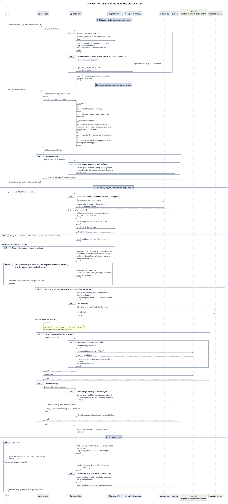

# Op 基类开发者指南

本指南说明 TileOPs 的 `Op` 基类：

- 它替每个 op 完成什么；
- op 子类向它声明什么；
- 构造和调用在基类内部经过哪些步骤。

读者是修改 `Op` 基类及其生成代码的开发者，以及需要了解 op 层内部实现的开发者。

## 1. 本指南的范围 {#scope}

本指南只覆盖 `Op` 基类。以下主题各有自己的指南；本指南用到其中的结论时引用，不重复其内容。

**表 1** 相关指南

| No. | 主题 | 指南 |
| --- | --- | --- |
| 1 | • 新增一个 op 的步骤：manifest 条目、op 类的成员、`kernel_for` 的参数 • 注册、测试与 benchmark | [添加一个新 op](../../new-op.md) |
| 2 | • 在 `torch.compile` 中调用 op • 编译边界的生成条件与冷编译要求 • custom op 与 fake 的生成 | [接入 torch.compile](../../torch-compile.md) |
| 3 | • kernel 接口与实现的选择 • 新增 kernel • backend 接入 | [op 如何选择 kernel](../dispatch/index.md) |
| 4 | • manifest 条目的格式 • 从签名生成的检查 | [读写 manifest](../manifest/index.md) |

## 2. Op 与 Kernel {#op-kernel}

运行自己 kernel 的算子分成两个类：

1. **Op** 检查输入，选择 kernel，组装输出。
    - 有 manifest 条目的 op 类，类名与条目的 key 相同。
    - 供具体 op 继承的中间基类可以没有条目。
1. **Kernel** 是可调用的实现对象，持有在设备上执行的 TileLang 程序与 tile 配置；程序可能在第一次启动时才构建。

组合 op 可以只持有子 op，不声明自己的 kernel，见[组合 op](composite.md)。

op 实例构造一次，调用多次：

- **构造时传入：**
    - manifest 声明的参数；
    - 执行策略 `target`；
    - 少数 op 还接收 family 自己定义的额外参数，见下文。
- **每次调用时才知道：** 调用时传入的张量的 shape 与 dtype。它们由这次调用决定，所以不作为构造参数。
    - 没有张量输入的 op，这些信息由构造参数给出。
    - manifest 在参数中声明的张量（构造期张量）在构造时传入，例如 `LongRoPEFwdOp` 的 `rescale_factors`；它的 shape 与 dtype 在构造检查中使用。
- **kernel：** 第一次需要某种特化时构造，然后缓存，之后同一种特化直接重用。in-tree 的 entry 是否重用，由实现的 `entry_for` 返回的 identity 决定；target 构造的 kernel 按调用设备与各输入的 dtype、shape 缓存。见[构造与调用 § kernel 缓存](lifecycle.md#kernel)。

**额外的构造参数：** 类属性 `injected_parameters` 是 manifest validator 的白名单。

- 构造函数中 manifest 没有声明的参数，除执行策略 `target` 外，只有列在这里的才被允许。
- 这些参数由 family 自己定义和使用，不是基类的扩展机制；基类只负责放行它们的名字。
- 目前只有 MoE 的 `FusedMoE` 使用，列出 `prepare_finalize` 与 `experts`。

## 3. op 的生命周期 {#lifecycle}

本指南区分三个主语：

1. **op 类**：继承 `Op` 的子类，例如 `RMSNormFwdOp`。
1. **op 实例**：op 类构造出的对象。
1. **一次调用**：对 op 实例的一次调用。
    - op 实例是可调用对象：`Op` 定义了 `__call__`。
    - `op(x, weight)` 调用的是 `Op.__call__`，由它进入子类的 `forward`。
    - `Op` 不继承 `torch.nn.Module`。

一个 op 依次经过三个阶段：

**表 2** op 的三个阶段

| No. | 阶段 | 主语 | 触发 | 次数 |
| --- | --- | --- | --- | --- |
| 1 | 类定义 | op 类 | • 导入 op 所在的模块，执行 `class` 语句 • `Op.__init_subclass__` 运行 | 每个 op 类一次 |
| 2 | 构造 | op 实例 | • `op = RMSNormFwdOp(normalized_shape=(4096,))` • 子类的 `__init__` 运行，其中调用 `Op.__init__` | 每个 op 实例一次 |
| 3 | 调用 | 一次调用 | • `y = op(x, weight)` • `Op.__call__` 运行 | 每次调用 |

图 1 把三个阶段的关键步骤按时间顺序串起来，调用阶段分为执行与结束两段。

**图 1** 一个 op 从类定义到调用结束的时序。

图 1 的读法：

- **步骤编号：** 构造阶段的「第 n 步」对应[构造与调用 § 构造](lifecycle.md#construct)表 1；调用与结束阶段的「第 n 步」对应[构造与调用 § 一次调用的七步](lifecycle.md#serve)表 3。
- **`opt` 框**只在条件成立时执行；**`alt` 框**按条件执行其中一个分支。
- **`kernel_for` 只画到「构造 entry」。** 选择实现的细节见 [op 如何选择 kernel § 一次调用如何找到 kernel](../dispatch/index.md#call-path)。
- **图中只画以普通张量进行的 eager 调用。** 以 meta 张量 eager 调用有编译边界的 op 时，生成的 fake 运行签名检查，不进入 `_run_call`；被 trace 时，没有编译边界的 op 跳过签名检查，有编译边界的 op 由 fake 运行签名检查，也不进入 `_run_call`。两者见[构造与调用 § 调用入口](lifecycle.md#entry)。

**表 3** 各阶段中基类与子类的分工

| No. | 阶段 | 基类完成 | 子类提供 |
| --- | --- | --- | --- |
| 1 | 类定义 | • 从 manifest 条目生成签名检查、输出 shape 推导；条目提供 `roofline` 时生成 `eval_roofline` • 条目有调用期张量输入、且没有 composition 时，生成 custom op，即编译边界 • 记下 manifest 参数的名字，调用 target 的 builder 时按这些名字传参 | • 有 manifest 条目的 op 类，类名与条目的 key 相同；中间基类可以没有条目 • 声明 `kernel_types`、`interfaces`、`delegate_types` |
| 2 | 构造 | `Op.__init__` 先保存 `target`，再依次： 1. 加载 backend 注册表 2. 按 manifest 检查参数取值 3. 安装实现表并检查契约 4. 登记实例 5. 建立实例状态字段 | • 直接继承 `Op` 的：把 manifest 参数赋给同名属性，再调用 `super().__init__(target=target)` • 经过 family 基类的：按 family 基类的签名传参，由它最终调用 `Op.__init__` • 之后建立派生属性与子 op |
| 3 | 调用：进入本体之前 | 1. 检查调用是否符合 manifest 签名。 2. 如果这次调用要写的张量都没有元素，就不运行 kernel，直接按签名返回结果。 3. 如果实例还没有 target，按调用设备选定一个。 | — |
| 4 | 调用：执行 | • 空写时按签名构造结果 • 否则，有 target 的 builder 时运行 target 的 kernel，没有时运行子类的本体 • 本体调用 `kernel_for` 时：查缓存，未命中时选择实现、构造 entry • 本体调用 `delegate_for` 时：构造或返回持有的子 op | • `forward` • 在其中调用 `kernel_for(interface, call)` 与 `delegate_for(stage, identity, ...)` |
| 5 | 调用：本体返回之后 | • 检查返回值 • 把子 op 的调用归入 stage • 保存调用记录 `last_call` | — |
| 6 | 调用失败 | • 丢弃这次调用的记录，`last_call` 不变 • target 在这次调用中选定时：撤销 target，丢弃已构造的 kernel，逐层撤销子 op 的绑定 • target 在之前的调用中选定时：target、kernel 与子 op 都保留 | — |

表 3 的说明：

- **调用各行描述 eager 调用。** 在 `torch.compile` 中被 trace 时，没有编译边界的 op 跳过签名检查，见[构造与调用 § 调用入口](lifecycle.md#entry)。
- **构造阶段不碰 kernel。** 它不选择、也不构造任何 kernel，不读取设备属性。
- **选择实现与构造 kernel 在调用时进行。** 要等张量的 dtype、shape 与设备都已知：
    - 运行 in-tree kernel 时，由 `kernel_for` 选择实现并取得 entry；
    - 由 target 服务时，基类调用 target 的 builder 构造 kernel 并缓存。
- `Op.__init__` 的各步为什么放在构造时，见[构造与调用 § 构造](lifecycle.md#construct)。

另有两类职责不属于某一次调用：

1. **roofline。**
    - `eval_roofline()` 对最近一次调用的记录求值。
    - FLOPs 不在 fp32 CUDA core 上计算的子类覆盖 `roof_key()`。
    - 见[调用记录与调优 § roofline](records.md#roofline)。
1. **调优与枚举。**
    - `request_tune()` 是进入调优模式的唯一方式：它把 op 及其子 op 置为调优模式，并向 `iter_kernels()` 枚举到的已构造 kernel 发出调优请求；之后构造的 in-tree entry 也按该模式调优；请求到不了 target 时发出警告。
    - `iter_kernels()` 等方法枚举已构造的 kernel。
    - 见[调用记录与调优](records.md)。

由此得到子类遵守的三条规则：

1. **不重复检查。** 子类不重复签名已经声明的检查，也不检查设备类型。
    - 本体运行时，签名检查已经通过。
    - kernel 自己声明能在哪些设备上运行。
1. **不自建缓存。** 子类不维护 kernel 缓存，也不以某个属性是否为空来决定是否构造 kernel；缓存由 `kernel_for` 负责。
1. **子 op 只经 `delegate_for` 持有。** 未经持有的子 op 完成调用时，父调用报错。

## 4. 基类的成员 {#members}

基类的成员按使用者分成三层：

1. **对外接口：** 调用 op 的代码使用，见表 4。
1. **对内接口：** op 子类声明或调用，见表 5。
1. **内部实现：** 子类不调用，也不覆盖，见本节末尾。

**表 4** 对外接口：调用 op 的代码使用

| No. | 成员 | 作用 | 详见 |
| --- | --- | --- | --- |
| 1 | 构造参数 `target` | 执行策略，每个 op 都接收 | [构造与调用 § target 与实现表](lifecycle.md#target) |
| 2 | `__call__` | • 调用 op：调用方写 `op(...)` • 参数由子类的 `forward` 决定；调用方不直接调用 `forward` | [构造与调用 § 调用入口](lifecycle.md#entry) |
| 3 | `serving_target` | 这个实例选定的 target | [构造与调用 § target 与实现表](lifecycle.md#target) |
| 4 | `last_call`、`eval_roofline()` | 最近一次完成的调用，及其 `(flops, bytes)` | [调用记录与调优 § last_call](records.md#last-call) |
| 5 | `request_tune()`、`kernel_config()` | 调优，及读取所用配置 | [调用记录与调优 § 调优](records.md#tune) |
| 6 | `iter_kernels()`、`built_entries(interface)`、`held_delegates()` | 枚举已构造的 kernel、entry 与子 op | [调用记录与调优 § 枚举](records.md#enumerate) |

**表 5** 对内接口：op 子类声明或调用

| No. | 成员 | 作用 | 详见 |
| --- | --- | --- | --- |
| 1 | `Op.__init__(*, target=None)` | • 子类赋值 manifest 参数之后，以 `super().__init__(...)` 调用 • 派生属性与子 op 在它之后建立 | [构造与调用 § 构造](lifecycle.md#construct) |
| 2 | `kernel_types`、`interfaces` | 子类的 kernel 接口与实现 | [构造与调用 § kernel 缓存](lifecycle.md#kernel) |
| 3 | `injected_parameters` | • manifest validator 的白名单：构造函数在 manifest 参数与执行策略之外允许的参数名 • 参数本身由 family 定义和使用，不是基类的扩展机制 | [构造与调用 § 构造](lifecycle.md#construct) |
| 4 | `dtype` | • 基类声明的默认值 `None` • 接收 `dtype` 构造参数的子类覆盖它 | [构造与调用 § 构造](lifecycle.md#construct) |
| 5 | `forward` | 计算本体，每个 op 都只写这一个方法；有编译边界时，基类经生成的 `_call_boundary` 在 custom op 内运行它 | [构造与调用 § 调用入口](lifecycle.md#entry) |
| 6 | `kernel_for(interface, call)`、`key_for(interface, call)` | • `kernel_for` 取得服务这次调用的 entry • `key_for` 只返回选中实现的 key，不构造 entry；测试用它检查选择结果 | [构造与调用 § kernel 缓存](lifecycle.md#kernel) |
| 7 | `delegate_types`、`delegate_for(stage, identity, ...)` | 声明并持有子 op | [组合 op](composite.md) |
| 8 | `roof_key()`、`eval_roofline_read_bytes()`、`roofline_data_terms()` | roofline 中可由子类覆盖的部分 | [调用记录与调优 § roofline](records.md#roofline) |

**内部实现：**

- 包括 `_run_call`、`_reset_binding`、调用栈，以及生成签名检查的 `_SignaturePlan`、生成编译边界的 `_CompileBoundary`。
- 这些成员以下划线开头，子类不调用，也不覆盖。
- 见[构造与调用](lifecycle.md)与[类结构与实例状态](structure.md)。

**从 manifest 条目生成、子类不编写的成员：** 签名检查、`_infer_output_shapes`、`eval_roofline`（条目提供 `roofline` 时）、`_call_boundary`（有编译边界时），以及编译边界的 custom op。

## 5. 本指南的页面 {#pages}

**表 6** 页面

| No. | 页面 | 内容 |
| --- | --- | --- |
| 1 | [构造与调用](lifecycle.md) | • `Op.__init__` • 调用入口、一次调用的七步 • target 与实现表 • kernel 缓存 • 失败与撤销 |
| 2 | [组合 op](composite.md) | • 子 op 的声明与持有 • 子 op 的调用如何归入父调用 |
| 3 | [调用记录与调优](records.md) | • `last_call` • roofline • 枚举 • 调优 |
| 4 | [类结构与实例状态](structure.md) | • 类图 • 生成代码的结构 • 实例状态的分组 • 新增内容时基类的保证 |
