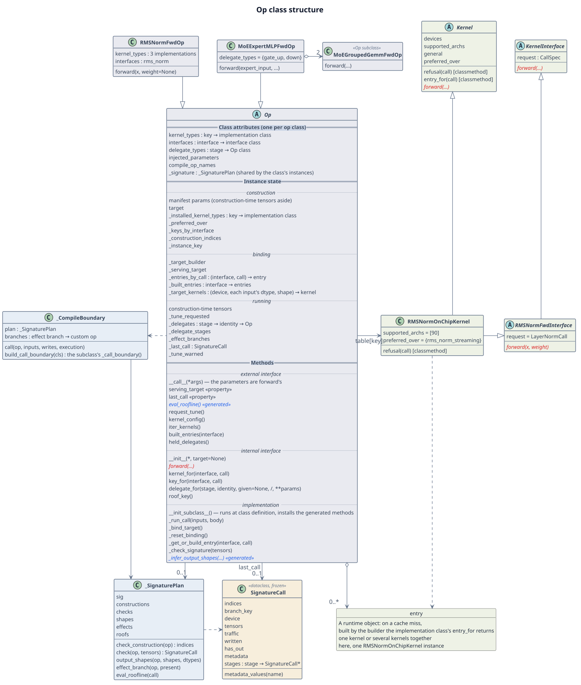

# Class structure and instance state

This page describes:

- the structure of the `Op` base class and the classes around it;
- how instance state is grouped;
- what the base class guarantees when an op, a target, a kernel implementation or a base
  class field is added.

It is written for developers who change the `Op` base class, `_signature_codegen.py` or
`compile_boundary.py`.

## 1. Class structure {#structure}

**Figure 1** The structure of `Op` and the classes around it, with some of their members.

Legend:

- A solid arrow is a reference, a hollow diamond is holding, a dashed arrow is a dependency,
  and a hollow triangle is inheritance;
- red italics are abstract methods a subclass must write by hand; blue italics marked
  «generated» are abstract methods on `Op` that the generated code implements for a class
  with a manifest entry, so a subclass does not write them; of these, `eval_roofline()` is
  generated only when the entry has a `roofline` field; an italic class name is an abstract
  class;
- the background color marks the layer: blue-grey for the op layer (`Op` and its
  subclasses), light blue for code generation (`_SignaturePlan`, `_CompileBoundary`), beige
  for call records (`SignatureCall`), and light green for the kernel layer (the kernel base
  classes, interfaces, implementation classes and entries);
- the box without an icon (entry) is a runtime object, not a class; a class marked «Op
  subclass» inherits `Op`, with the inheritance arrow left out to keep the edges clear; a
  member marked «property» is a read-only property, read as an attribute and not called;
- the `Op` box has three parts, separated by double lines and bold headings: class
  attributes, instance state and methods. Within each part, dotted lines and italic headings
  form groups: instance state in the construction, binding and running groups of
  [Table 2](#state); methods in the external interface, internal interface and
  implementation layers of [the index page § Members of the base class](index.md#members).

**Table 1** What the main base classes are responsible for

| No. | Class | Visibility | Responsible for | Details |
| --- | --- | --- | --- | --- |
| 1 | `Op` | public | the op's lifecycle: at construction, checking the parameters and installing the implementation table; at each call, checking the signature, selecting the target, getting the kernel, keeping the record and undoing on failure; holding sub-ops | [Construction and calls](lifecycle.md), [Composite ops](composite.md) |
| 2 | `SignatureCall` | public, read-only | the record of one call that passed the signature check, which callers use as read-only (`stages` is written before the record becomes `last_call`): index values, tensor shapes and dtypes, traffic, the sub-ops' calls; `last_call` and the roofline read it | [Call records and tuning § last_call](records.md#last-call) |
| 3 | `KernelInterface` | public | the call contract of one kernel interface: the call spec's type and `forward`'s arguments; every implementation of the interface inherits it | [How an op selects a kernel](../dispatch/index.md) |
| 4 | `Kernel` | public | the base class of kernel implementations: declares the devices it is available on (`devices`, `supported_archs`), the calls it serves (`refusal`) and its precedence over other implementations (`general`, `preferred_over`), and provides its builder through `entry_for` | [How an op selects a kernel](../dispatch/index.md) |
| 5 | `_SignaturePlan` | internal | the table of functions one op class's manifest signature generates: construction check, call check, output-shape inference, effect branch, roofline evaluation; shared by the class's instances | [Construction and calls § The seven steps of a call](lifecycle.md#serve) |
| 6 | `_CompileBoundary` | internal | registers the custom ops for an op class with a compile boundary and generates `_call_boundary`, so the op is one node of the graph in `torch.compile` | [Construction and calls § Call entry points](lifecycle.md#entry) |

Visibility follows the Python convention: a name starting with an underscore is non-public,
used only by the base class and the generated code, and a subclass neither calls nor
implements it. `SignatureCall` is defined in the private module `_signature_codegen.py`, and
callers get its instances through `op.last_call`.

How the classes in the figure relate:

- **At class definition:** `__init_subclass__` installs the signature methods and the compile
  boundary the manifest entry generates, and records the manifest parameter names a target's
  builder is called with.
    - A class without a manifest entry gets no signature methods, and its parameter names are
      an empty tuple.
    - When an instance is constructed, `Op.__init__` then runs the construction check.
- **`_SignaturePlan`:** every class with a manifest entry holds `_signature`, the
  `_SignaturePlan` all its instances share.
    - The first time a construction point is used, it generates that point's check functions
      and caches them in itself.
    - These caches depend only on the manifest.
- **`_CompileBoundary`:** registers one custom op per effect branch and generates
  `_call_boundary()`.
    - A branch is decided by the inputs written, whether `out` is passed, and the outputs
      returned.
    - The custom op's body looks the instance up by the key it was registered under and calls
      `Op._run_call()`.
- **Entries and implementation classes:** an entry is built by the selected implementation
  class. An implementation class inherits both `Kernel` and a kernel interface; for example,
  `RMSNormOnChipKernel` inherits `Kernel` and `RMSNormFwdInterface`.

## 2. Instance state {#state}

Instance state is grouped by how the fields behave: the fields of one group are treated alike
when a target selection is undone, though they may be written at different times. Two
questions decide a field's group:

1. Does it depend on the target this call selected? If so, it is in the binding group, reset
   when the target selection is undone.
1. A field that does not depend on it is kept on undo; then, is it written again after
   construction? If not, it is in the construction group; if so, in the running group.

The binding group's three caches are built empty at construction, but their contents depend on
the selected target, so they belong to the binding group.

**Table 2** Instance state

| No. | Group | Written | On undoing the target selection | Fields |
| --- | --- | --- | --- | --- |
| 1 | construction | at construction, never after | kept | manifest parameters (construction-time tensors aside), `target`, `_installed_kernel_types`, `_preferred_over`, `_keys_by_interface`, `_construction_indices`, `_instance_key` |
| 2 | binding | when a target is selected and kernels are built | reset to initial values | `_target_builder`, `_serving_target`, `_entries_by_call`, `_built_entries`, `_target_kernels` |
| 3 | running | still written after construction | kept | construction-time tensors, `_tune_requested`, `_delegates`, `_delegate_stages`, `_effect_branches`, `_last_call`, `_tune_warned` |

Notes on Table 2:

- **Construction group:** written by the constructor and `Op.__init__`. A composite op that
  declares no kernel of its own does not build `_installed_kernel_types`, `_preferred_over`
  or `_keys_by_interface`, and reads the empty mappings on the class attributes.
- **Binding group:** built empty or given class-attribute initial values at construction,
  listed in Table 3; written in steps 4 and 5 of a call, see
  [Construction and calls § The seven steps of a call](lifecycle.md#serve); reset to the
  initial values by `_reset_binding` on undo, see
  [Construction and calls § Failure and undo](lifecycle.md#failure).
- **Running group:**
    - `_tune_requested` starts as `False`, and only `request_tune()` sets it to `True`;
    - `_effect_branches` is decided by the manifest, this instance's construction parameters
      and which optional inputs a call passes, not by the selected target;
    - a construction-time tensor (such as `LongRoPEFwdOp`'s `rescale_factors`) whose device
      or dtype differs from the call's is converted at the call and written back to the
      instance;
    - `_tune_warned` remembers that the tuning warning has been issued, so an instance warns
      once.

!!! note "How the binding and running groups relate"

    Both groups are written during calls; they differ only in whether their contents depend
    on the target this instance selected:

    - **The binding group is "which target this call selected, and what was built for it"**:
      the selected target, its builder, and the kernels built and cached under it. They hold
      only while this target is the selected one, so when the call that selected the target
      fails, `_reset_binding` resets the whole group to its initial values, and the next call
      selects and builds again.
    - **The running group is "what calls accumulate, whichever target is selected"**: the
      held sub-ops, the effect-branch cache, the record of the last successful call, the
      tuned mode and the warning flag. They still hold under another target, so undo keeps
      them.

    The two groups interact in three places:

    1. **Undo travels down through the sub-ops in the running group.** When a composite op
       undoes, it also calls `_reset_binding` on every sub-op in `_delegates`: the parent
       keeps holding the sub-ops, and each sub-op resets its own binding group.
    1. **The running group's tuned mode decides how the binding group is built.** When the
       instance is in tuned mode, a kernel newly built in the binding group is put in tuned
       mode right after it is built; `request_tune()` sets `_tune_requested` and sends a
       tuning request to the built kernels `iter_kernels()` yields. Kernels a target built
       are not among them, and when the request cannot reach the target, it warns.
    1. **Undo does not touch the record of the last success.** When the target was selected
       in the failing call, the binding group is reset; undone or not, a failed call does not
       write `_last_call`, and `last_call` still points to the earlier successful call.

**Table 3** Binding group fields

| No. | Field | Contents | Initial value |
| --- | --- | --- | --- |
| 1 | `_target_builder` | • The selected target's builder • `None` means the in-tree kernels | class-attribute default `_UNRESOLVED`, meaning not selected yet |
| 2 | `_serving_target` | The selected target's name, which the `serving_target` property reads | class-attribute default `None` |
| 3 | `_entries_by_call` | The cache from `(interface, call)` to entry; a hit is one lookup | an empty table `Op.__init__` builds when it installs the implementation table |
| 4 | `_built_entries` | The entries under each interface, keyed by `(implementation class, identity)`; `built_entries` reads it | an empty table `Op.__init__` builds when it installs the implementation table |
| 5 | `_target_kernels` | • The kernels a target built, keyed by device and each input's dtype and shape • An optional input that is not passed holds its own slot | an empty table `Op.__init__` builds |

The base class's methods read and write these fields without asking whether they exist,
because after construction they all do:

- the binding group's three cache fields, and the running group's `_delegates`,
  `_delegate_stages` and `_effect_branches`, are built by `Op.__init__`;
- `_target_builder` and `_serving_target` have class-attribute initial values.

## 3. What the base class guarantees when something is added {#extend}

Adding an op, a composite op, a target or a kernel implementation leaves the base class's
guarantees unchanged. The "What to do" column of Table 4 lists what joining the base class
takes; the full steps to add an op (tests, benchmarks, registration and so on) are in
[Adding a new op](../../new-op.md).

**Table 4** What is added, and what the base class guarantees

| No. | Added | What to do | The base class guarantees |
| --- | --- | --- | --- |
| 1 | an op with a compile boundary | • A manifest entry of the same name, with a call-time tensor input and no composition • Passing a cold `fullgraph=True` compile • When it runs kernels of its own, declaring `kernel_types` and `interfaces` • The constructor and `forward` • Registering the cold-compile test | `_run_call` does the checks, target selection, recording and failure handling |
| 2 | an op without a compile boundary | • A manifest entry of the same name • When it runs kernels of its own, declaring `kernel_types` and `interfaces` • The constructor and `forward` | the same |
| 3 | a composite op | `delegate_types`, with every sub-op held through `delegate_for` | every sub-call is filed under one stage, or the call raises |
| 4 | a target | registering a builder for the op | the same checks, recording and failure handling as the in-tree kernels |
| 5 | a kernel implementation | • Inheriting both `Kernel` and the kernel interface, and registering, as in [Adding a kernel to an op](../dispatch/writing.md#register) • Overriding the default `refusal`, `entry_for` and precedence where needed | • The op does not change • Entries are cached by `(implementation class, identity)` |
| 6 | a base class state field | • Building it in `Op.__init__`, or giving it a class-attribute initial value • When it belongs to the binding group, adding it to `_reset_binding`'s reset list | • The field always exists after construction • Nothing of it remains after a target selection is undone |
